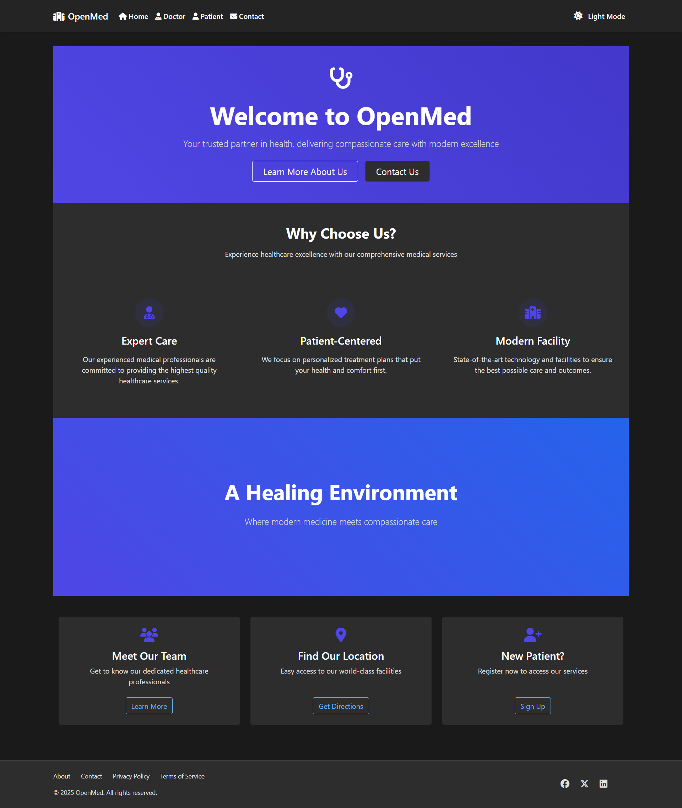

# OpenMed

A comprehensive hospital Infromation system built with Django that streamlines healthcare facility operations by managing doctors, patients, appointments, and room allocations.



## 🌟 Key Features

- **Multi-User System**
  - Role-based access control (Admin, Doctor, Patient)
  - Secure authentication and authorization
  - Custom dashboards for each user type

- **Patient Management**
  - Patient registration and records
  - Medical history tracking
  - Appointment scheduling
  - Discharge management
  - Digital medical records

- **Doctor Management**
  - Doctor registration and profiles
  - Specialization tracking
  - Appointment management
  - Patient assignment

- **Appointment System**
  - Online booking
  - Approval workflow
  - Schedule management
  - Email notifications
  - Appointment history

- **Room Management**
  - Room allocation
  - Occupancy tracking
  - Room types and capacity
  - Patient assignment

- **Administrative Tools**
  - User approval system
  - Report generation
  - System monitoring
  - Settings management

## 📋 Prerequisites

- Python 3.8 or higher
- Django 5.0 or higher
- SQLite (default) or PostgreSQL
- Modern web browser

## 🚀 Quick Start

1. **Clone the repository**
   ```bash
   git clone https://github.com/yourusername/hospital-management.git
   cd hospital-management
   ```

2. **Set up a virtual environment**
   ```bash
   python -m venv .venv
   
   # On Windows
   .venv\Scripts\activate
   
   # On macOS/Linux
   source .venv/bin/activate
   ```

3. **Install dependencies**
   ```bash
   pip install -r requirements.txt
   ```

4. **Configure environment**
   ```bash
   # Copy example environment file
   cp .env.example .env
   
   # Edit .env with your settings
   nano .env
   ```

5. **Initialize database**
   ```bash
   python manage.py makemigrations
   python manage.py migrate
   ```

6. **Run development server**
   ```bash
   python manage.py runserver
   ```

7. Visit http://127.0.0.1:8000/ in your browser

8. **Admin Login Credentials**
   ```
   Username: hospitaladmin
   Password: Admin@123
   http://127.0.0.1:8000/adminclick to login
   ```


## 📚 Documentation

Detailed documentation is available in the [docs](docs/) directory:

### System Documentation
- [System Requirements](docs/system-requirements.md)
- [System Architecture](docs/system-diagrams.md)
  - Context Diagram
  - Data Flow Diagrams
  - UI Navigation Tree
- [Use Cases and Sequence Diagrams](docs/use-cases.md)
  - User Management Flows
  - Patient Use Cases
  - Doctor Use Cases
  - Admin Use Cases
  - System Processes

### User Documentation
- [User Guide](docs/user-guide.md)
  - [Admin Manual](docs/admin-guide.md)
  - [Doctor Manual](docs/doctor-guide.md)
  - [Patient Manual](docs/patient-guide.md)

### Technical Documentation
- [Developer Guide](docs/developer-guide.md)
  - [Setup Guide](docs/setup-guide.md)
  - [Database Schema](docs/database-schema.md)
  - [API Documentation](docs/api-docs.md)
- [Contributing Guide](docs/contributing.md)
- [Deployment Guide](docs/deployment.md)

## 🏗️ Project Structure

```
hospital-management/
├── hospital/                 # Main application
│   ├── models.py            # Database models
│   ├── views.py             # View logic
│   ├── forms.py             # Form definitions
│   └── admin.py             # Admin interface
├── templates/               # HTML templates
│   └── hospital/           # App-specific templates
├── static/                 # Static assets
│   ├── css/               # Stylesheets
│   ├── js/                # JavaScript files
│   └── img/               # Images
├── docs/                  # Documentation
│   ├── system-diagrams.md # System architecture
│   ├── use-cases.md      # Use cases & flows
│   └── api-docs.md       # API documentation
├── requirements.txt       # Python dependencies
└── manage.py             # Django management
```

## 🔒 Security Features

- Built-in Django security features
- CSRF protection
- Password hashing
- Session security
- XSS prevention
- SQL injection protection
- Role-based access control
- Audit logging
- Password policies
- Rate limiting

## 🤝 Contributing

We welcome contributions! Please see our [Contributing Guide](docs/contributing.md) for details.

1. Fork the repository
2. Create a feature branch
3. Commit your changes
4. Push to your branch
5. Create a Pull Request

## 📄 License

This project is licensed under the MIT License - see the [LICENSE](LICENSE) file for details.

## 👥 Authors

- SazPy - [GitHub](https://github.com/sazpy)

## 🙏 Acknowledgments

- Django Team
- Bootstrap Team
- All contributors 