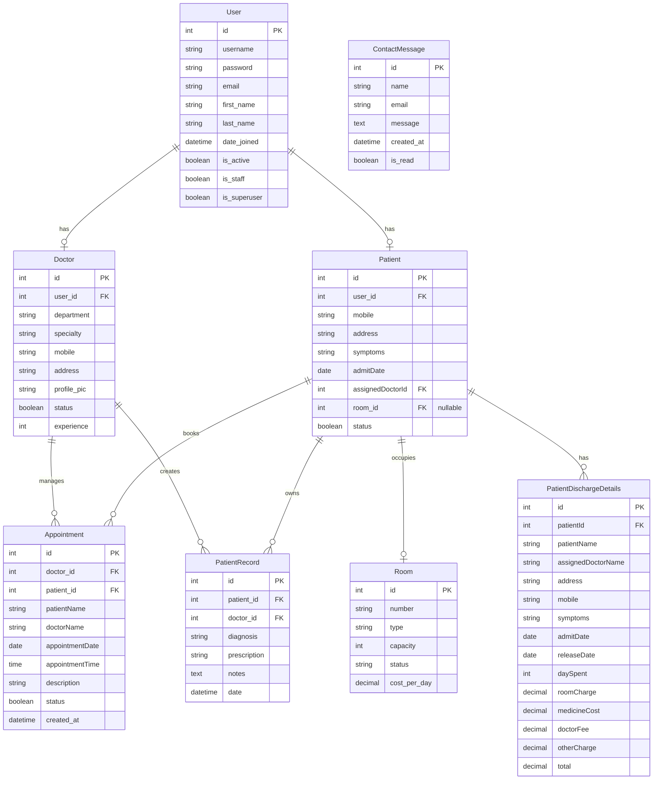

# Database Schema Documentation

This document outlines the database structure of the Hospital Management System.

## Overview

The system uses a relational database with the following main entities:
- Users
- Doctors
- Patients
- Appointments
- Rooms
- Medical Records
- Contact Messages

## Entity Relationship Diagram

## Table Descriptions

### User
The base user model provided by Django's authentication system.

| Column | Type | Description |
|--------|------|-------------|
| id | Integer | Primary key |
| username | String | Unique username |
| password | String | Hashed password |
| email | String | Email address |
| first_name | String | First name |
| last_name | String | Last name |
| date_joined | DateTime | Account creation date |
| is_active | Boolean | Account status |
| is_staff | Boolean | Staff status |
| is_superuser | Boolean | Superuser status |

### Doctor
Extends the User model with doctor-specific information.

| Column | Type | Description |
|--------|------|-------------|
| id | Integer | Primary key |
| user_id | Integer | Foreign key to User |
| department | String | Medical department |
| specialty | String | Medical specialty |
| mobile | String | Contact number |
| address | String | Physical address |
| profile_pic | String | Profile picture path |
| status | Boolean | Account approval status |
| experience | Integer | Years of experience |

### Patient
Extends the User model with patient-specific information.

| Column | Type | Description |
|--------|------|-------------|
| id | Integer | Primary key |
| user_id | Integer | Foreign key to User |
| mobile | String | Contact number |
| address | String | Physical address |
| symptoms | String | Current symptoms |
| admitDate | Date | Admission date |
| assignedDoctorId | Integer | Foreign key to Doctor |
| room_id | Integer | Foreign key to Room (nullable) |
| status | Boolean | Account approval status |

### Appointment
Manages doctor appointments with patients.

| Column | Type | Description |
|--------|------|-------------|
| id | Integer | Primary key |
| doctor_id | Integer | Foreign key to Doctor |
| patient_id | Integer | Foreign key to Patient |
| patientName | String | Patient's full name |
| doctorName | String | Doctor's full name |
| appointmentDate | Date | Appointment date |
| appointmentTime | Time | Appointment time |
| description | String | Appointment description |
| status | Boolean | Approval status |
| created_at | DateTime | Creation timestamp |

### Room
Manages hospital rooms and their allocation.

| Column | Type | Description |
|--------|------|-------------|
| id | Integer | Primary key |
| number | String | Room number |
| type | String | Room type |
| capacity | Integer | Room capacity |
| status | String | Occupancy status |
| cost_per_day | Decimal | Daily cost |

### PatientRecord
Stores medical records for patients.

| Column | Type | Description |
|--------|------|-------------|
| id | Integer | Primary key |
| patient_id | Integer | Foreign key to Patient |
| doctor_id | Integer | Foreign key to Doctor |
| diagnosis | String | Medical diagnosis |
| prescription | String | Prescribed medications |
| notes | Text | Additional notes |
| date | DateTime | Record creation date |

### PatientDischargeDetails
Records patient discharge information.

| Column | Type | Description |
|--------|------|-------------|
| id | Integer | Primary key |
| patientId | Integer | Foreign key to Patient |
| patientName | String | Patient's full name |
| assignedDoctorName | String | Doctor's name |
| address | String | Patient's address |
| mobile | String | Contact number |
| symptoms | String | Symptoms at admission |
| admitDate | Date | Admission date |
| releaseDate | Date | Discharge date |
| daySpent | Integer | Days hospitalized |
| roomCharge | Decimal | Room charges |
| medicineCost | Decimal | Medicine costs |
| doctorFee | Decimal | Doctor's fees |
| otherCharge | Decimal | Other charges |
| total | Decimal | Total bill amount |

### ContactMessage
Stores contact form submissions.

| Column | Type | Description |
|--------|------|-------------|
| id | Integer | Primary key |
| name | String | Sender's name |
| email | String | Sender's email |
| message | Text | Message content |
| created_at | DateTime | Submission time |
| is_read | Boolean | Read status |

## Indexes

### Primary Keys
- All tables have an auto-incrementing primary key `id`

### Foreign Keys
- Doctor.user_id → User.id
- Patient.user_id → User.id
- Patient.assignedDoctorId → Doctor.id
- Patient.room_id → Room.id
- Appointment.doctor_id → Doctor.id
- Appointment.patient_id → Patient.id
- PatientRecord.patient_id → Patient.id
- PatientRecord.doctor_id → Doctor.id
- PatientDischargeDetails.patientId → Patient.id

### Additional Indexes
- User.username (unique)
- User.email (unique)
- Room.number (unique)
- Appointment(doctor_id, appointmentDate, appointmentTime) (unique together)

## Constraints

1. Room Status must be one of:
   - 'available'
   - 'occupied'
   - 'maintenance'

2. Room Type must be one of:
   - 'general'
   - 'private'
   - 'icu'
   - 'emergency'

3. Doctor Department must be one of the predefined specialties

4. Appointment times must be during hospital hours (8:00-17:00)

5. Patient can only be assigned to one room at a time

## Data Integrity

- ON DELETE CASCADE for User deletion
- ON DELETE RESTRICT for Doctor deletion if has active patients
- Soft delete implemented for most entities using status field
- Timestamps automatically set and updated 