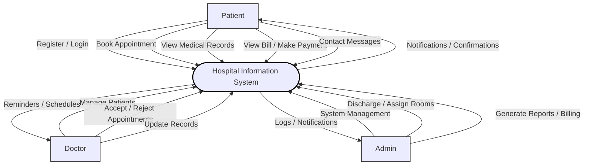
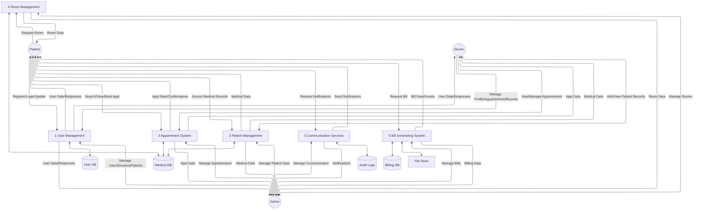
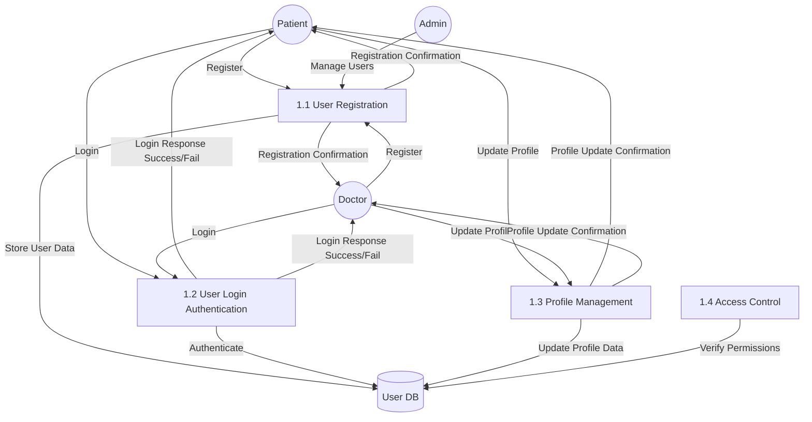
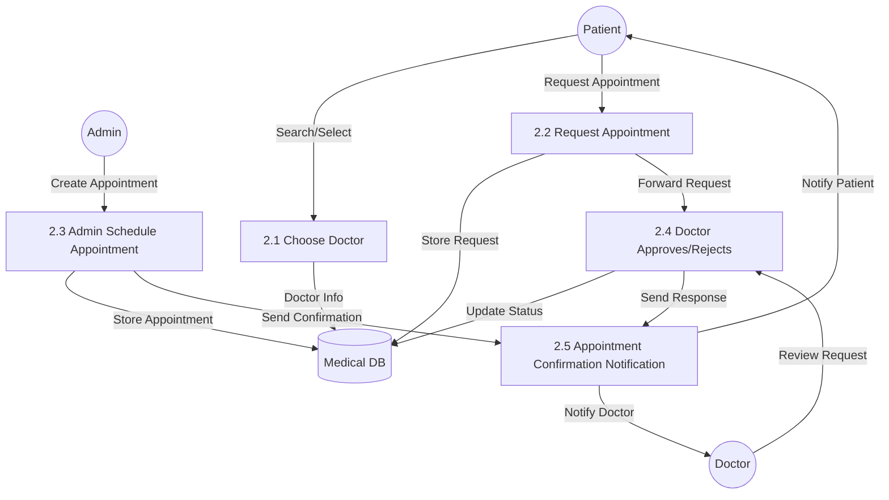
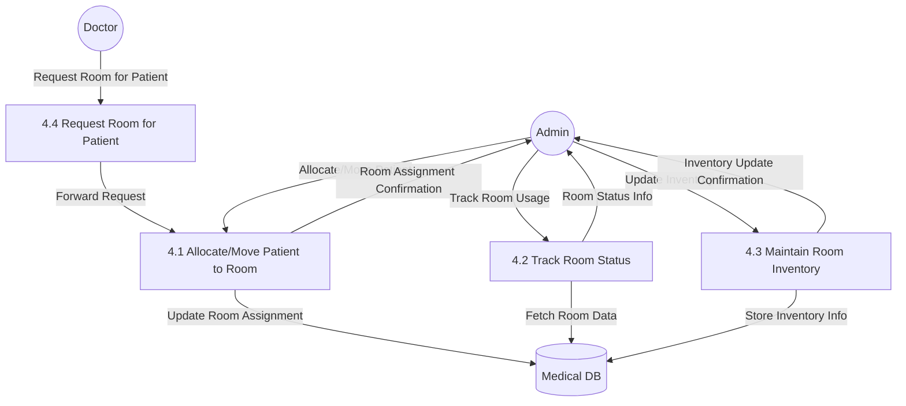
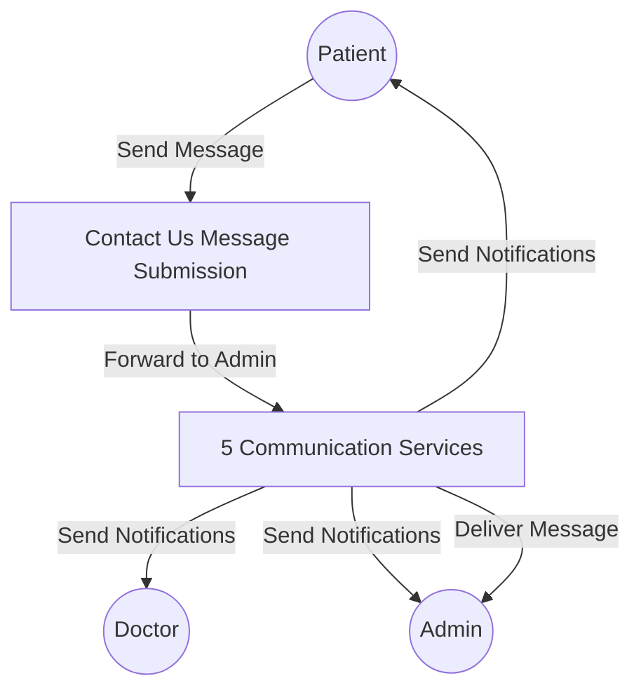
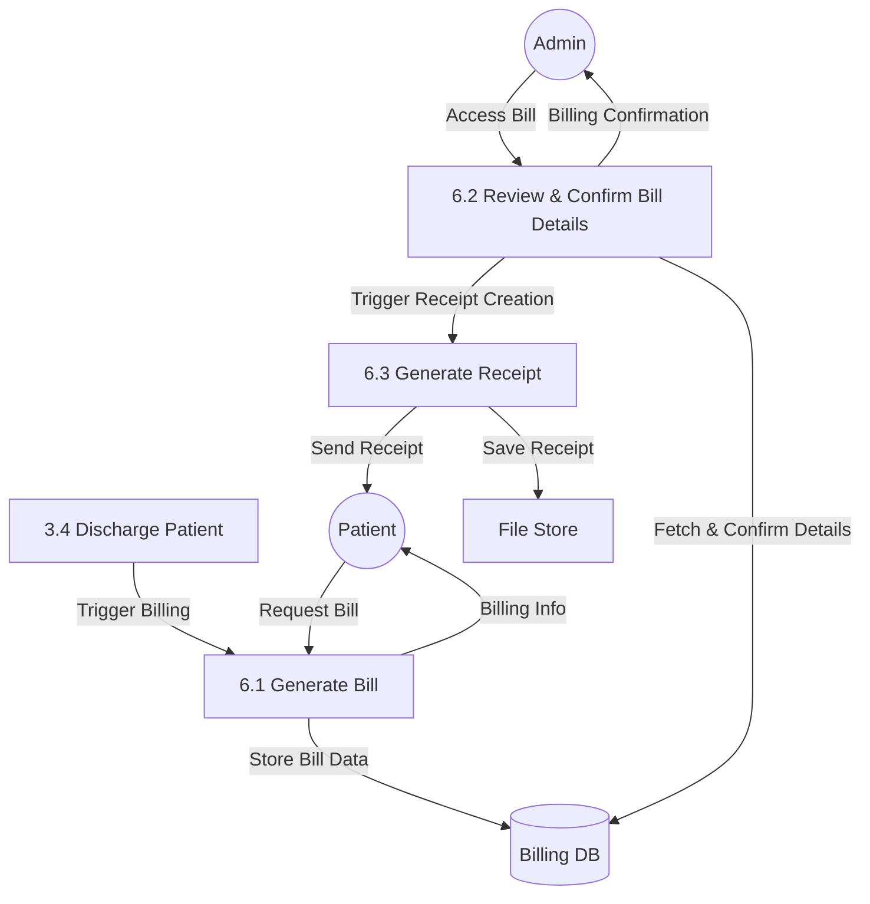
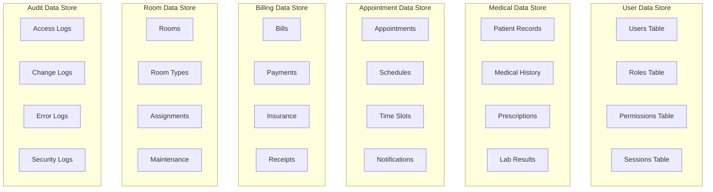

# System Diagrams

## Context Diagram




## Data Flow Diagram (Level 0)


## Data Flow Diagram (Level 1)
# 1. User Management


# 2. Appointment System



# 3. Patient Management
```memraid
graph TD
    Patient((Patient))
    Doctor((Doctor))
    Admin((Admin))

    P3_1[3.1 Add/Update Medical Record]
    P3_2[3.2 View Medical History]
    P3_3[3.3 Manage Documents]
    P3_4[3.4 Discharge Patient]

    DB2[(Medical DB)]
    FS[File Store]

    %% Doctor Activities
    Doctor -->|Add/Edit Record| P3_1
    P3_1 -->|Store Record| DB2

    Doctor -->|View History| P3_2
    P3_2 -->|Fetch History| DB2
    P3_2 -->|Return Data| Doctor

    Doctor -->|Upload Files| P3_3
    P3_3 -->|Store Files| FS
    P3_3 -->|Confirm Upload| Doctor

    %% Patient View
    Patient -->|View History| P3_2
    P3_2 -->|Return Data| Patient

    Patient -->|View Documents| P3_3
    P3_3 -->|Fetch Files| FS
    P3_3 -->|Return Files| Patient

    %% Admin Discharge
    Admin -->|Discharge Patient| P3_4
    P3_4 -->|Update Discharge Info| DB2
    P3_4 -->|Generate Summary| FS
    P3_4 -->|Confirm Discharge| Admin
    P3_4 -->|Notify Patient| Patient

```

# 4. Room Management


# 5. Communication Services


# 6. Bill Generating system

## UI Navigation Tree

```mermaid
graph TD
    Home[Home Page]
    
    %% Main Sections
    Home -->|Login| Auth[Authentication]
    Home -->|About| About[About Us]
    Home -->|Contact| Contact[Contact Us]
    
    %% Authentication Branches
    Auth -->|Admin| AdminAuth[Admin Login]
    Auth -->|Doctor| DoctorAuth[Doctor Login]
    Auth -->|Patient| PatientAuth[Patient Login]
    Auth -->|Forgot| Reset[Password Reset]
    
    %% Admin Section
    AdminDash[Admin Dashboard]
    AdminAuth --> AdminDash
    AdminDash --> AD1[Doctor Management]
    AdminDash --> AD2[Patient Management]
    AdminDash --> AD3[Room Management]
    AdminDash --> AD4[Reports]
    AdminDash --> AD5[Messages]
    AdminDash --> AD6[System Config]
    
    %% Doctor Section
    DoctorDash[Doctor Dashboard]
    DoctorAuth --> DoctorDash
    DoctorDash --> DD1[My Patients]
    DoctorDash --> DD2[Appointments]
    DoctorDash --> DD3[Room Requests]
    DoctorDash --> DD4[Profile]
    DoctorDash --> DD5[Schedule]
    
    %% Patient Section
    PatientDash[Patient Dashboard]
    PatientAuth --> PatientDash
    PatientDash --> PD1[Book Appointment]
    PatientDash --> PD2[My Appointments]
    PatientDash --> PD3[Medical History]
    PatientDash --> PD4[Bills]
    PatientDash --> PD5[Profile]
    PatientDash --> PD6[Documents]
    
    %% Doctor Management
    AD1 --> DM1[View Doctors]
    AD1 --> DM2[Add Doctor]
    AD1 --> DM3[Approve Doctor]
    AD1 --> DM4[Schedule]
    
    %% Patient Management
    AD2 --> PM1[View Patients]
    AD2 --> PM2[Add Patient]
    AD2 --> PM3[Medical Records]
    AD2 --> PM4[Billing]
    
    %% Room Management
    AD3 --> RM1[View Rooms]
    AD3 --> RM2[Assign Room]
    AD3 --> RM3[Maintenance]
    AD3 --> RM4[Room Types]
```




## Data Store Details

