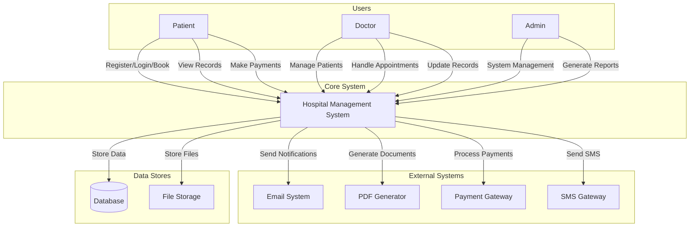
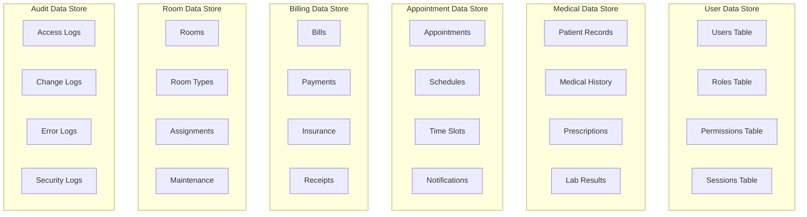

# System Diagrams

## Context Diagram

```mermaid
graph TD
    subgraph External Systems
        E[Email System]
        PDF[PDF Generator]
        PAY[Payment Gateway]
        SMS[SMS Gateway]
    end
    
    subgraph Core System
        HMS[Hospital Management System]
    end
    
    subgraph Users
        P[Patient]
        D[Doctor]
        A[Admin]
    end
    
    subgraph Data Stores
        DB[(Database)]
        FS[File Storage]
    end
    
    P -->|Register/Login/Book| HMS
    P -->|View Records| HMS
    P -->|Make Payments| HMS
    
    D -->|Manage Patients| HMS
    D -->|Handle Appointments| HMS
    D -->|Update Records| HMS
    
    A -->|System Management| HMS
    A -->|Generate Reports| HMS
    
    HMS -->|Store Data| DB
    HMS -->|Store Files| FS
    HMS -->|Send Notifications| E
    HMS -->|Generate Documents| PDF
    HMS -->|Process Payments| PAY
    HMS -->|Send SMS| SMS
```

## Data Flow Diagram (Level 1)

```mermaid
graph TD
    subgraph User Management
        UM1[Authentication]
        UM2[Registration]
        UM3[Profile Management]
        UM4[Access Control]
    end
    
    subgraph Appointment System
        AS1[Booking]
        AS2[Scheduling]
        AS3[Notifications]
        AS4[Calendar]
    end
    
    subgraph Patient Management
        PM1[Records]
        PM2[History]
        PM3[Billing]
        PM4[Documents]
    end
    
    subgraph Room Management
        RM1[Allocation]
        RM2[Tracking]
        RM3[Maintenance]
        RM4[Inventory]
    end
    
    subgraph Communication
        CM1[Email]
        CM2[SMS]
        CM3[Notifications]
    end
    
    subgraph Payment System
        PS1[Billing]
        PS2[Processing]
        PS3[Receipts]
    end
    
    subgraph Security
        SEC1[Authentication]
        SEC2[Authorization]
        SEC3[Audit]
    end
    
    subgraph Data Stores
        DB1[(User DB)]
        DB2[(Medical DB)]
        DB3[(Billing DB)]
        DB4[(Audit DB)]
        FS[File Store]
    end
    
    %% User Management Flows
    UM1 -->|Auth Data| DB1
    UM2 -->|User Data| DB1
    UM3 -->|Profile Updates| DB1
    UM4 -->|Access Logs| DB4
    
    %% Appointment Flows
    AS1 -->|Bookings| DB2
    AS2 -->|Schedule| DB2
    AS3 -->|Notifications| CM1
    AS4 -->|Calendar Data| DB2
    
    %% Patient Management Flows
    PM1 -->|Patient Data| DB2
    PM2 -->|Medical History| DB2
    PM3 -->|Billing Data| DB3
    PM4 -->|Documents| FS
    
    %% Room Management Flows
    RM1 -->|Room Data| DB2
    RM2 -->|Status| DB2
    RM3 -->|Maintenance| DB2
    RM4 -->|Inventory| DB2
    
    %% Communication Flows
    CM1 -->|Emails| DB4
    CM2 -->|SMS| DB4
    CM3 -->|System Messages| DB4
    
    %% Payment Flows
    PS1 -->|Bills| DB3
    PS2 -->|Transactions| DB3
    PS3 -->|Receipts| FS
    
    %% Security Flows
    SEC1 -->|Auth Logs| DB4
    SEC2 -->|Access Logs| DB4
    SEC3 -->|Audit Trail| DB4
```

## UI Navigation Tree

```mermaid
graph TD
    Home[Home Page]
    
    %% Main Sections
    Home -->|Login| Auth[Authentication]
    Home -->|About| About[About Us]
    Home -->|Contact| Contact[Contact Us]
    
    %% Authentication Branches
    Auth -->|Admin| AdminAuth[Admin Login]
    Auth -->|Doctor| DoctorAuth[Doctor Login]
    Auth -->|Patient| PatientAuth[Patient Login]
    Auth -->|Forgot| Reset[Password Reset]
    
    %% Admin Section
    AdminDash[Admin Dashboard]
    AdminAuth --> AdminDash
    AdminDash --> AD1[Doctor Management]
    AdminDash --> AD2[Patient Management]
    AdminDash --> AD3[Room Management]
    AdminDash --> AD4[Reports]
    AdminDash --> AD5[Messages]
    AdminDash --> AD6[System Config]
    
    %% Doctor Section
    DoctorDash[Doctor Dashboard]
    DoctorAuth --> DoctorDash
    DoctorDash --> DD1[My Patients]
    DoctorDash --> DD2[Appointments]
    DoctorDash --> DD3[Room Requests]
    DoctorDash --> DD4[Profile]
    DoctorDash --> DD5[Schedule]
    
    %% Patient Section
    PatientDash[Patient Dashboard]
    PatientAuth --> PatientDash
    PatientDash --> PD1[Book Appointment]
    PatientDash --> PD2[My Appointments]
    PatientDash --> PD3[Medical History]
    PatientDash --> PD4[Bills]
    PatientDash --> PD5[Profile]
    PatientDash --> PD6[Documents]
    
    %% Doctor Management
    AD1 --> DM1[View Doctors]
    AD1 --> DM2[Add Doctor]
    AD1 --> DM3[Approve Doctor]
    AD1 --> DM4[Schedule]
    
    %% Patient Management
    AD2 --> PM1[View Patients]
    AD2 --> PM2[Add Patient]
    AD2 --> PM3[Medical Records]
    AD2 --> PM4[Billing]
    
    %% Room Management
    AD3 --> RM1[View Rooms]
    AD3 --> RM2[Assign Room]
    AD3 --> RM3[Maintenance]
    AD3 --> RM4[Room Types]
```

## Data Store Details

```mermaid
graph TD
    subgraph User Data Store
        UD1[Users Table]
        UD2[Roles Table]
        UD3[Permissions Table]
        UD4[Sessions Table]
    end
    
    subgraph Medical Data Store
        MD1[Patient Records]
        MD2[Medical History]
        MD3[Prescriptions]
        MD4[Lab Results]
    end
    
    subgraph Appointment Data Store
        AD1[Appointments]
        AD2[Schedules]
        AD3[Time Slots]
        AD4[Notifications]
    end
    
    subgraph Billing Data Store
        BD1[Bills]
        BD2[Payments]
        BD3[Insurance]
        BD4[Receipts]
    end
    
    subgraph Room Data Store
        RD1[Rooms]
        RD2[Room Types]
        RD3[Assignments]
        RD4[Maintenance]
    end
    
    subgraph Audit Data Store
        AUD1[Access Logs]
        AUD2[Change Logs]
        AUD3[Error Logs]
        AUD4[Security Logs]
    end
```