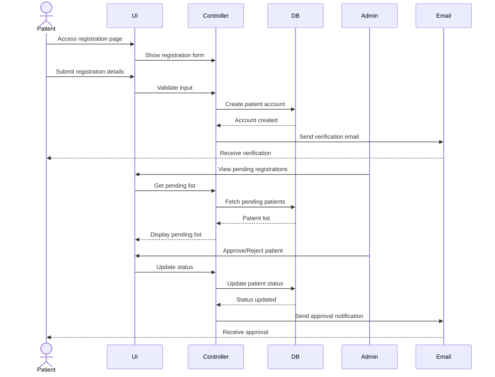
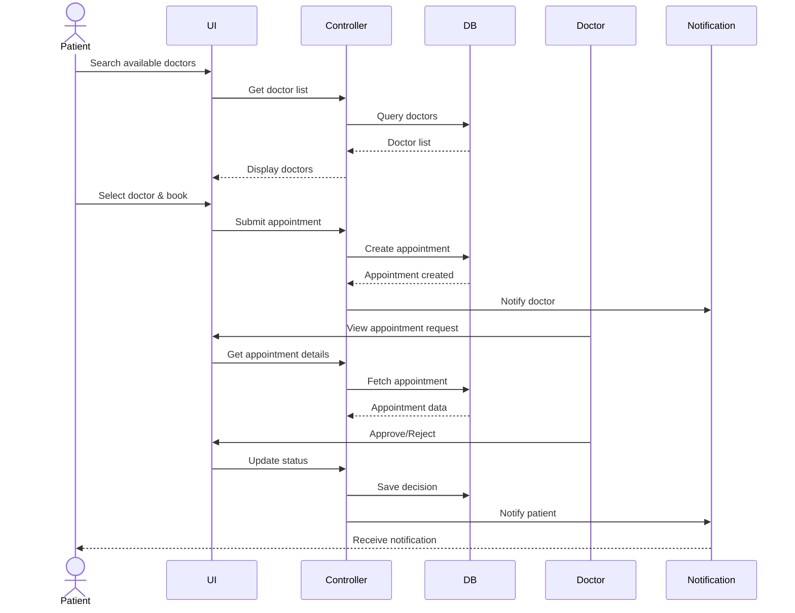
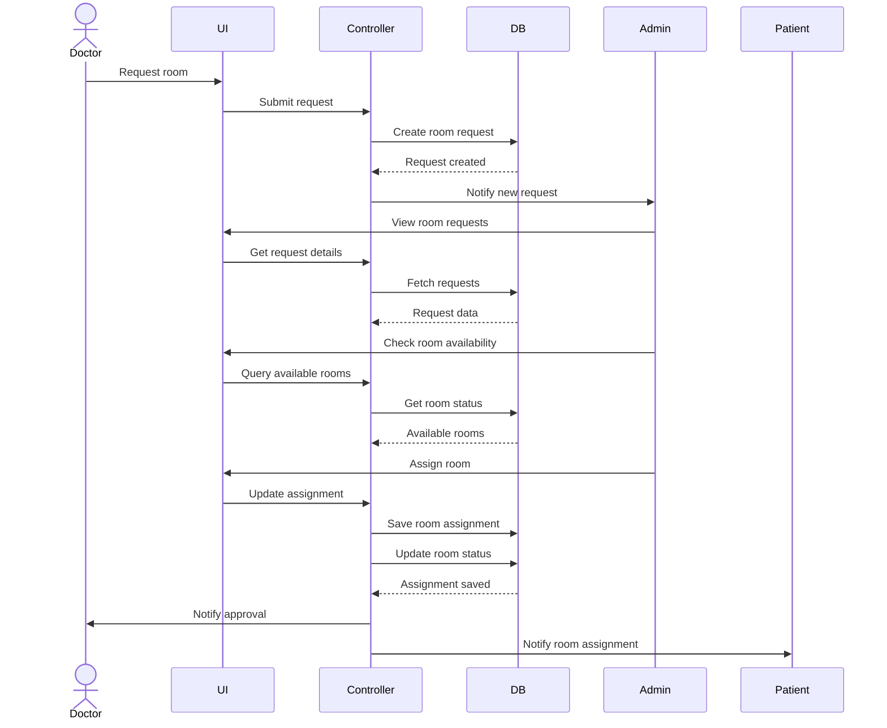
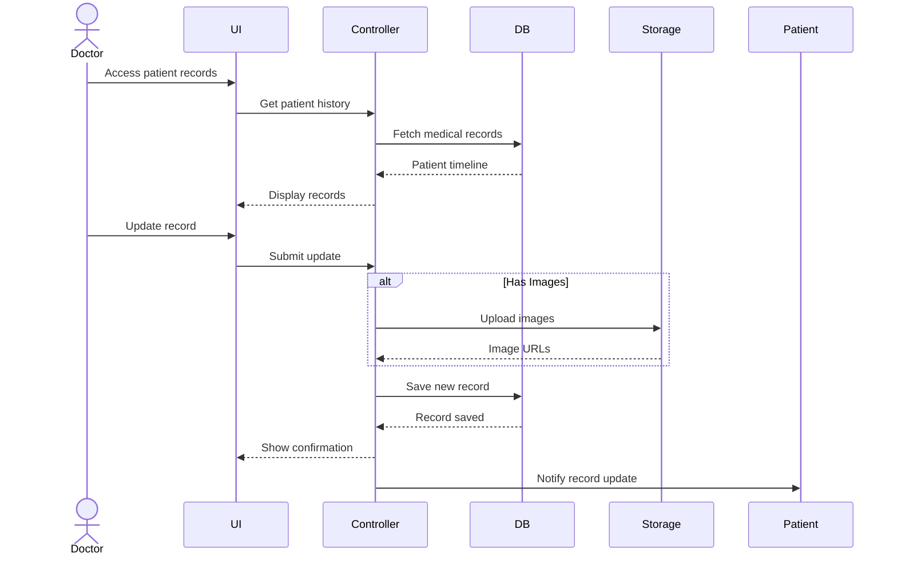
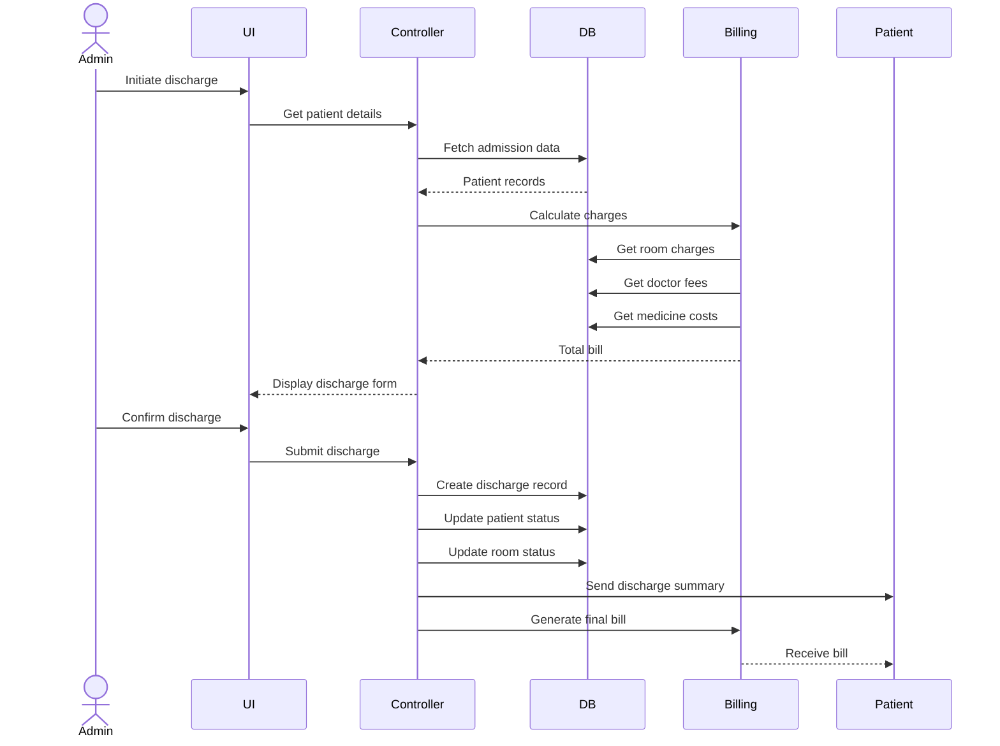
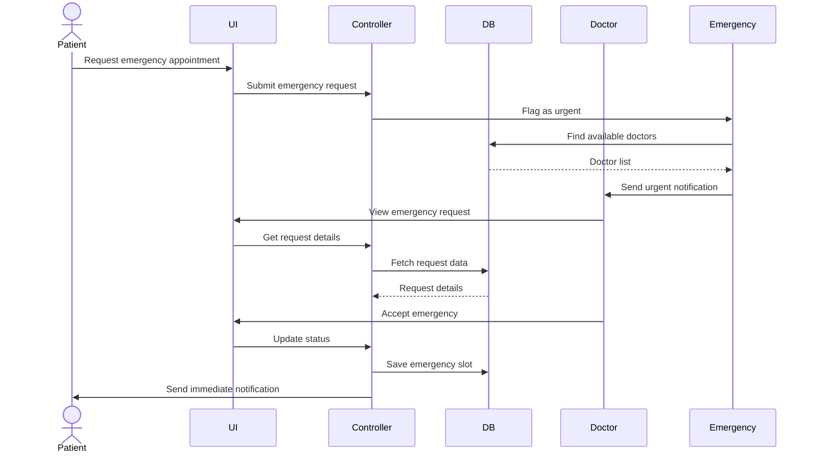
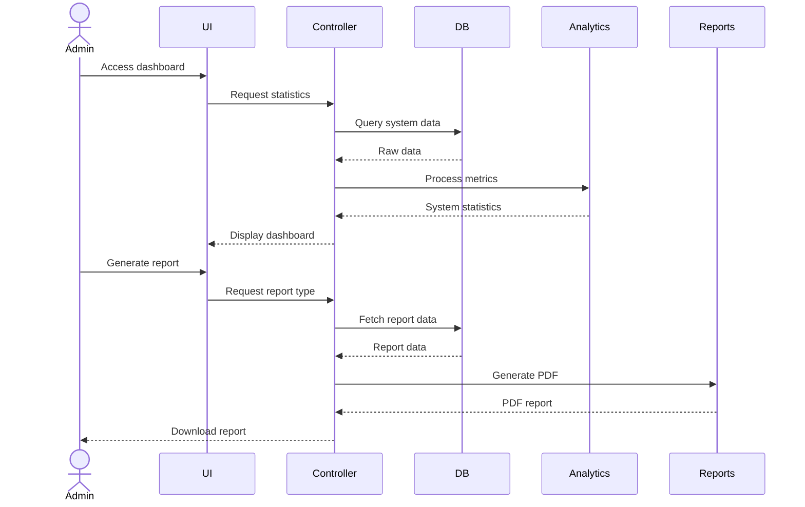
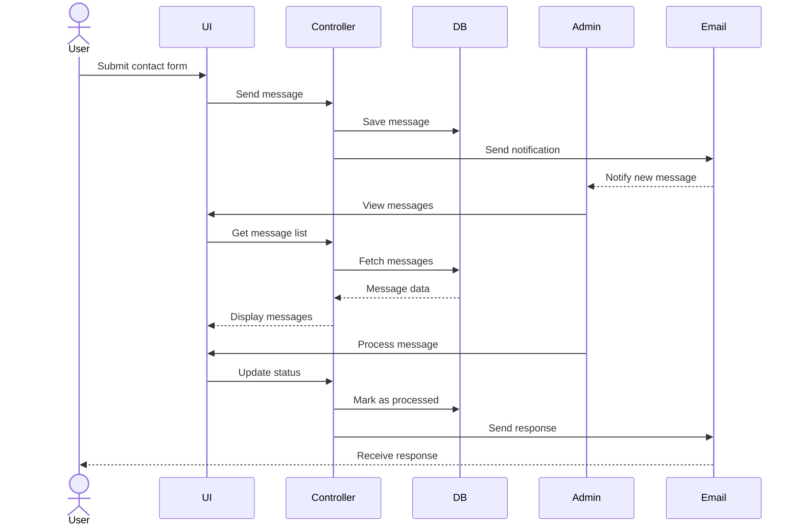
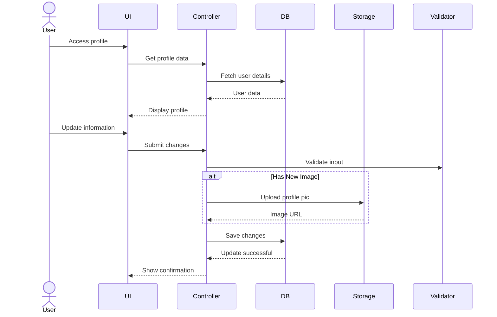
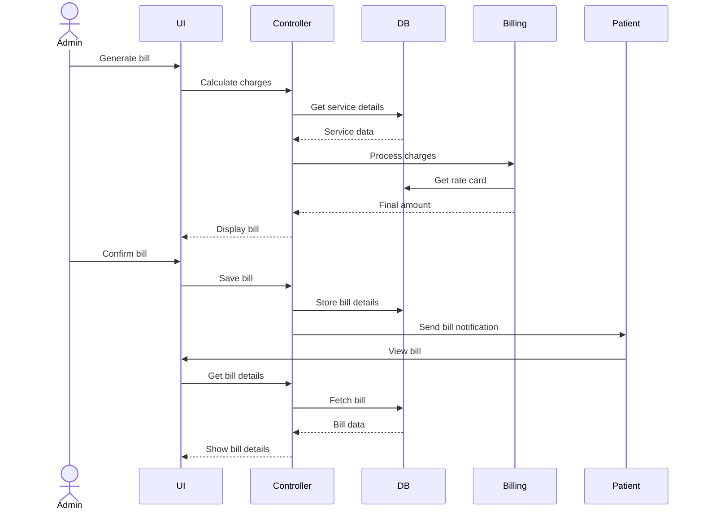

# Hospital Management System - Use Cases and Sequence Diagrams

## Core Use Cases

### Admin Use Cases

| Use Case | Preconditions | Actions |
|----------|---------------|----------|
| Doctor Management | Admin is logged in | View, add, update, delete doctors; approve/reject registrations; view specializations & departments; track appointments; manage offices |
| Patient Management | Admin is logged in | View, add, update patients; approve/reject registrations; view details & appointments; manage discharge; track history; assign rooms |
| Room Management | Admin is logged in | View, add, update rooms; assign/change rooms; process requests; view occupancy; manage room types; track availability; handle maintenance |
| Appointment Management | Admin is logged in | View, schedule, approve/reject, cancel, reschedule appointments; view details, statistics, history; manage emergency appointments |
| System Administration | Admin is logged in | Manage user accounts; view statistics & audit logs; handle contact messages; monitor performance; configure departments & system parameters; backup |
| Billing Management | Admin is logged in | Generate bills; calculate charges; process doctor fees & medicine costs; handle additional charges & refunds; view payment history; generate reports |

### Doctor Use Cases

| Use Case | Preconditions | Actions |
|----------|---------------|----------|
| Patient Management | Doctor is logged in & approved | View/search assigned patients; view details, appointments, history; update medical records; add notes; handle emergencies; request tests |
| Appointment Management | Doctor is logged in & approved | View, approve/reject, cancel, reschedule appointments; set availability hours; manage follow-ups; view history & set priorities |
| Room Management | Doctor is logged in & approved | Request room/change for patients; specify room requirements; track request status; view available rooms & occupancy; manage office hours |
| Medical Records Management | Doctor is logged in & approved | Create/update patient records, diagnoses; prescribe meds; add notes; upload images; document allergies, vitals, lab results, procedures, prescriptions |
| Profile Management | Doctor is logged in & approved | Update personal info, contact details; manage specializations & working hours; view stats, performance metrics; manage notifications |

### Patient Use Cases

| Use Case | Preconditions | Actions |
|----------|---------------|----------|
| Appointment Management | Patient is logged in & approved | Book, view, cancel, reschedule appointments; search/view doctors; track status; view history; rate doctors; set reminders |
| Medical Records | Patient is logged in & approved | View medical history, prescriptions, treatment details; access discharge summary; track medications; download reports; view billing history |
| Room Management | Patient is logged in & approved | View assigned room/details/charges; request room change; track requests; submit feedback |
| Profile Management | Patient is logged in & approved | Update personal/contact/insurance/emergency info; manage notifications; view medical profile, treatment history, billing status |
| Communication | Patient is logged in & approved | Contact hospital; submit feedback/issues; request information; view announcements & doctor responses; track message history |

## Sequence Diagrams

### 1. Patient Registration and Approval

### 2. Doctor Appointment Workflow

### 3. Room Assignment Process

### 4. Medical Record Management

### 5. Patient Discharge Process

### 6. Emergency Appointment Handling

### 7. System Monitoring and Reporting

### 8. Contact Message Management

### 9. Profile Management

### 10. Billing and Payment Processing

## System Features

### Authentication & Authorization
1. Role-based access control (Admin/Doctor/Patient)
2. Login with username/password
3. Session management
4. Access restrictions based on user role

### Data Management
1. Patient records with medical history
2. Doctor profiles with specializations
3. Room management with types (Ward/Private/ICU/Office)
4. Appointment scheduling system

### Security Features
1. Password hashing
2. CSRF protection
3. Form validation
4. Secure file uploads
5. Audit logging

### User Interface
1. Responsive dashboard for each role
2. Search functionality
3. Sorting and filtering
4. Status tracking
5. Notifications system