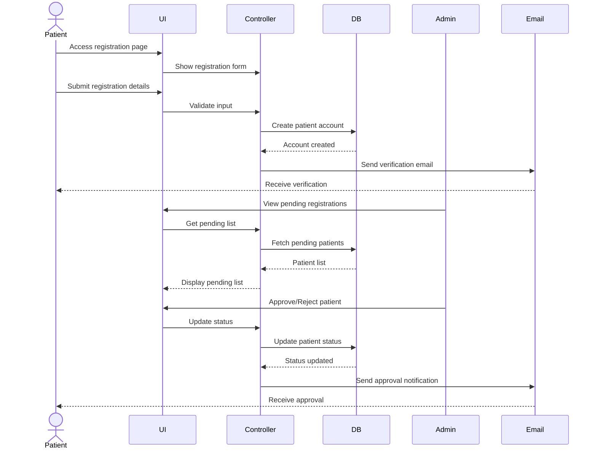
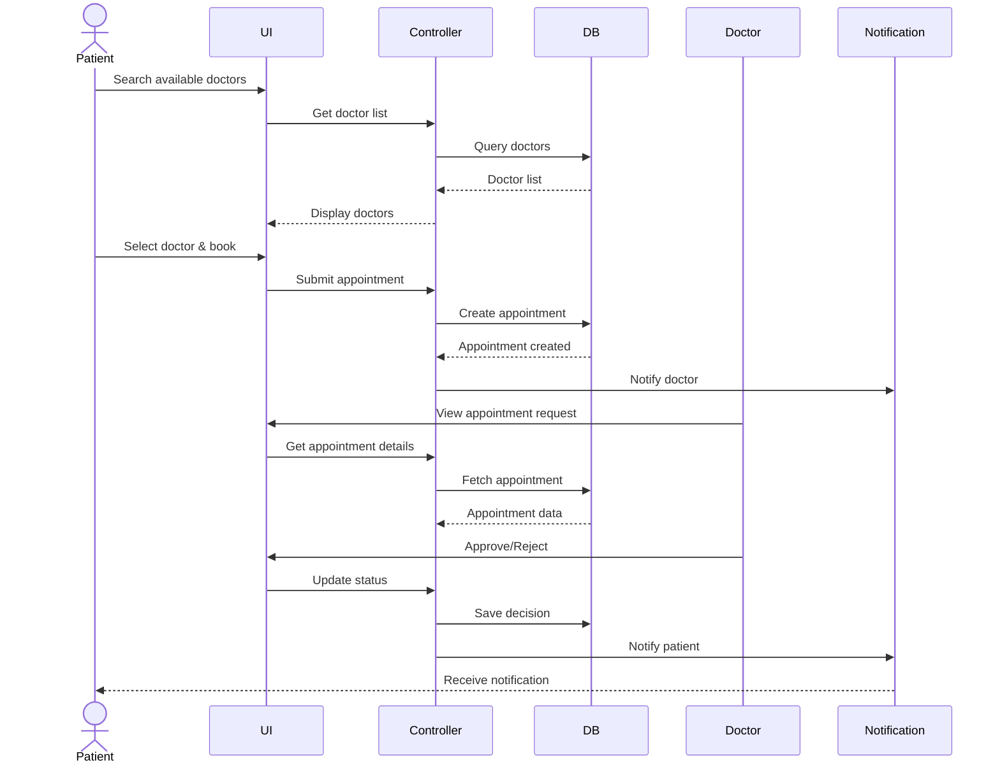
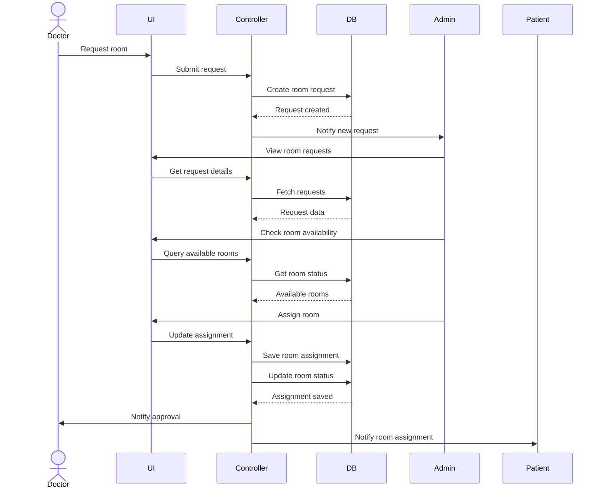
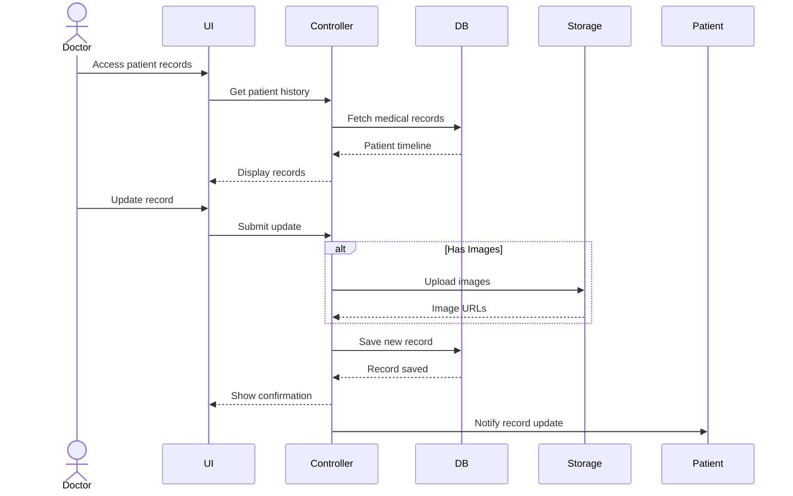
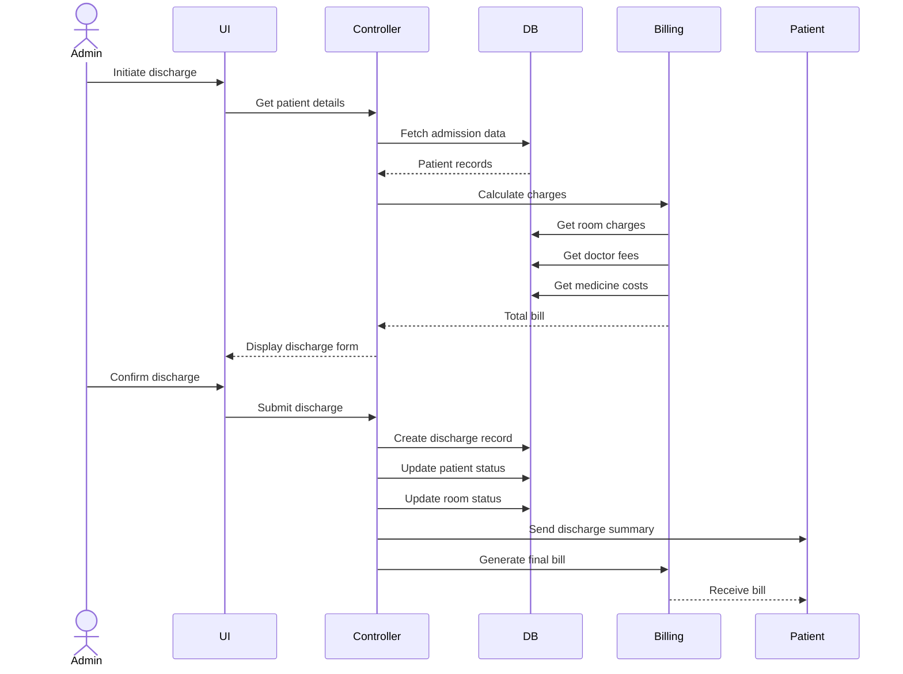
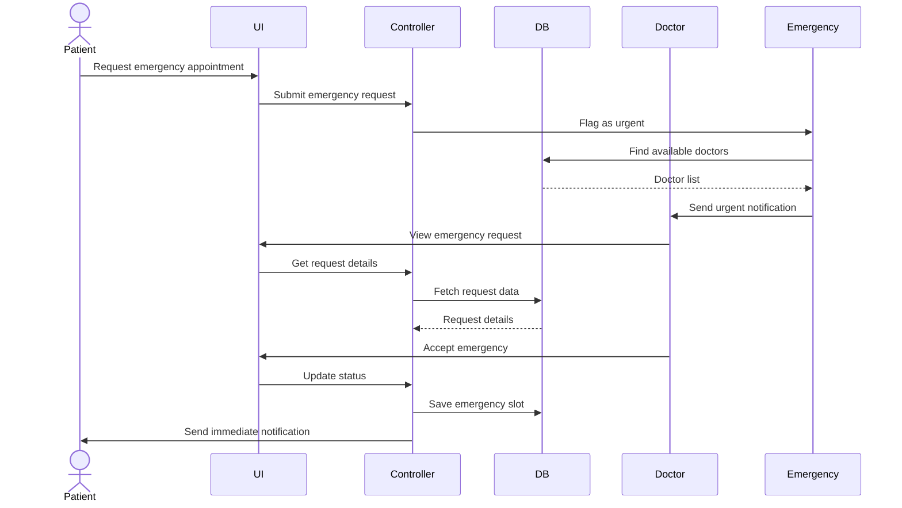
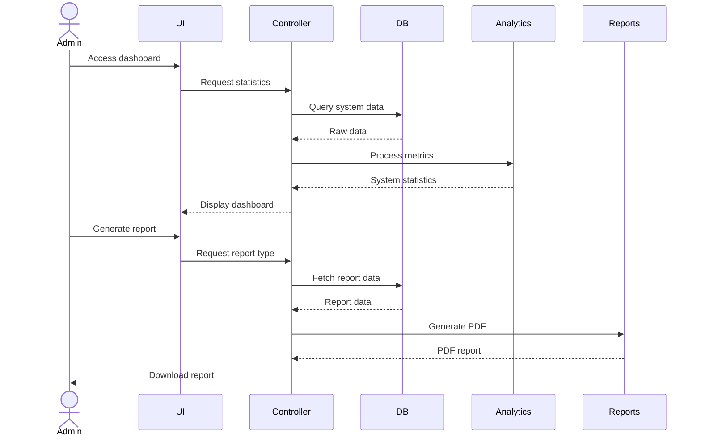
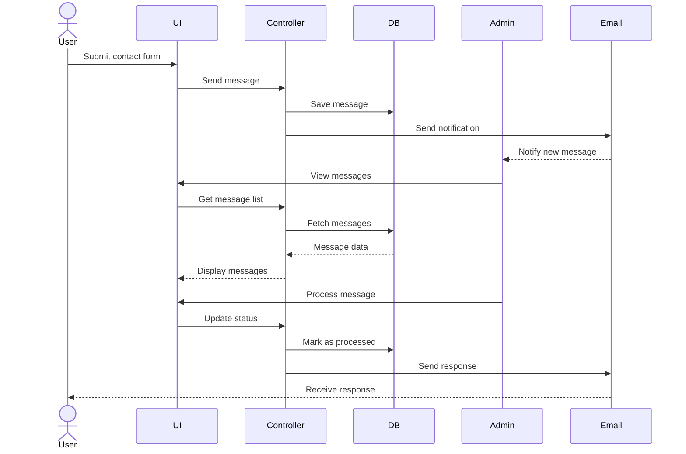
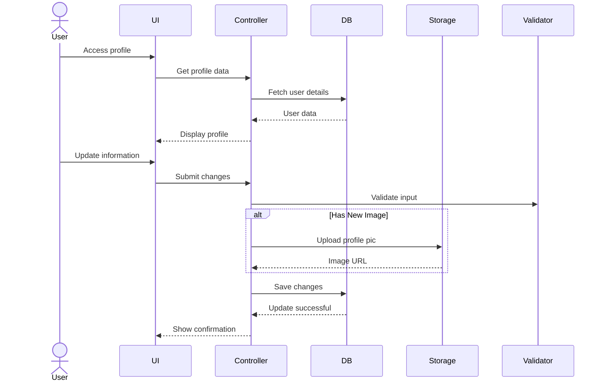
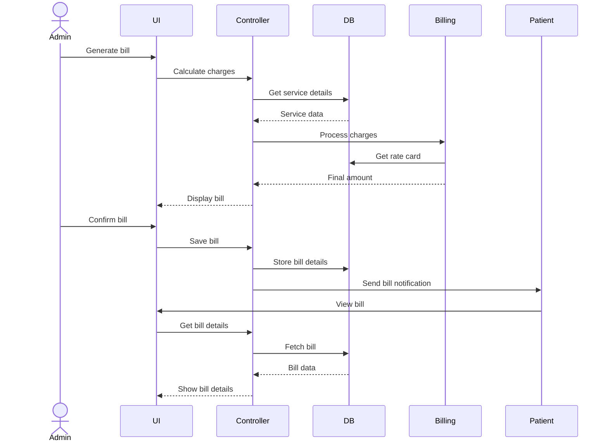

# Hospital Management System - Use Cases and Sequence Diagrams

## Core Use Cases

### Admin Use Cases

#### 1. Doctor Management
**Pre-conditions:** Admin is logged in

**Main Flow:**
1. View all doctors
2. Add new doctor
3. Update doctor information
4. Approve/reject doctor registrations
5. View doctor specializations
6. Delete doctor
7. View doctor departments
8. Track doctor appointments
9. Manage doctor offices

#### 2. Patient Management
**Pre-conditions:** Admin is logged in

**Main Flow:**
1. View all patients
2. Add new patient
3. Update patient information
4. Approve/reject patient registrations
5. View patient details
6. Manage patient discharge
7. Track patient medical history
8. View patient appointments
9. Manage patient room assignments

#### 3. Room Management
**Pre-conditions:** Admin is logged in

**Main Flow:**
1. View all rooms
2. Add new room
3. Update room information
4. Assign/change room for patient
5. Process room requests
6. View room occupancy
7. Manage room types (Ward/Private/ICU/Office)
8. Track room availability
9. Handle room maintenance
10. View room request history

#### 4. Appointment Management
**Pre-conditions:** Admin is logged in

**Main Flow:**
1. View all appointments
2. Schedule new appointment
3. Approve/reject appointments
4. View appointment details
5. Cancel appointments
6. Track appointment history
7. Manage emergency appointments
8. View appointment statistics
9. Handle appointment rescheduling

#### 5. System Administration
**Pre-conditions:** Admin is logged in

**Main Flow:**
1. Manage user accounts
2. View system statistics
3. Handle contact messages
4. Monitor system performance
5. View audit logs
6. Manage department settings
7. Configure system parameters
8. Generate system reports
9. Backup system data

#### 6. Billing Management
**Pre-conditions:** Admin is logged in

**Main Flow:**
1. Generate patient bills
2. Calculate room charges
3. Process doctor fees
4. Handle medicine costs
5. Manage additional charges
6. View payment history
7. Generate financial reports
8. Process refunds
9. Track outstanding payments

### Doctor Use Cases

#### 1. Patient Management
**Pre-conditions:** Doctor is logged in and approved

**Main Flow:**
1. View assigned patients
2. Search patients
3. View patient details
4. Update medical records
5. View discharge patients
6. Track patient history
7. Add patient notes
8. View patient appointments
9. Monitor patient progress
10. Request patient tests
11. View patient medications
12. Handle patient emergencies

#### 2. Appointment Management
**Pre-conditions:** Doctor is logged in and approved

**Main Flow:**
1. View appointments
2. Approve/reject appointment requests
3. View appointment schedule
4. Cancel appointments
5. Reschedule appointments
6. Handle emergency consultations
7. Set availability hours
8. View appointment history
9. Manage follow-ups
10. Set appointment priorities

#### 3. Room Management
**Pre-conditions:** Doctor is logged in and approved

**Main Flow:**
1. Request room for patient
2. View room requests status
3. Specify room requirements
4. Track request approval
5. View available rooms
6. Request room changes
7. Manage office hours
8. Handle emergency room requests
9. View room occupancy

#### 4. Medical Records Management
**Pre-conditions:** Doctor is logged in and approved

**Main Flow:**
1. Create patient records
2. Update diagnoses
3. Prescribe medications
4. Add medical notes
5. Upload medical images
6. View patient history
7. Track treatment progress
8. Record procedures
9. Manage prescriptions
10. Document allergies
11. Record vital signs
12. Handle lab results

#### 5. Profile Management
**Pre-conditions:** Doctor is logged in and approved

**Main Flow:**
1. Update personal information
2. View appointment statistics
3. Manage specializations
4. Set working hours
5. View patient load
6. Track performance metrics
7. Manage notifications
8. Update contact details

### Patient Use Cases

#### 1. Appointment Management
**Pre-conditions:** Patient is logged in and approved

**Main Flow:**
1. Book new appointment
2. View appointments
3. View available doctors
4. Search doctors by department
5. Track appointment status
6. Cancel appointments
7. Request rescheduling
8. View appointment history
9. Rate doctor service
10. Set appointment reminders

#### 2. Medical Records
**Pre-conditions:** Patient is logged in and approved

**Main Flow:**
1. View medical history
2. View assigned doctor
3. View treatment details
4. Access discharge summary
5. View prescriptions
6. Track medications
7. View test results
8. Download medical reports
9. View billing history
10. Track treatment progress

#### 3. Room Management
**Pre-conditions:** Patient is logged in and approved

**Main Flow:**
1. View assigned room
2. Request room change
3. View room details
4. Track room requests
5. View room charges
6. Submit room feedback

#### 4. Profile Management
**Pre-conditions:** Patient is logged in and approved

**Main Flow:**
1. Update personal information
2. View medical profile
3. Manage emergency contacts
4. Update insurance information
5. View treatment history
6. Manage notifications
7. Update contact details
8. View billing status

#### 5. Communication
**Pre-conditions:** Patient is logged in and approved

**Main Flow:**
1. Contact hospital
2. Submit feedback
3. View announcements
4. Request information
5. Report issues
6. View doctor responses
7. Track message history

## Sequence Diagrams

### 1. Patient Registration and Approval

```mermaid
sequenceDiagram
    actor Patient
    participant UI
    participant Controller
    participant DB
    participant Admin
    participant Email

    Patient->>UI: Access registration page
    UI->>Controller: Show registration form
    Patient->>UI: Submit registration details
    UI->>Controller: Validate input
    Controller->>DB: Create patient account
    DB-->>Controller: Account created
    Controller->>Email: Send verification email
    Email-->>Patient: Receive verification
    
    Admin->>UI: View pending registrations
    UI->>Controller: Get pending list
    Controller->>DB: Fetch pending patients
    DB-->>Controller: Patient list
    Controller-->>UI: Display pending list
    
    Admin->>UI: Approve/Reject patient
    UI->>Controller: Update status
    Controller->>DB: Update patient status
    DB-->>Controller: Status updated
    Controller->>Email: Send approval notification
    Email-->>Patient: Receive approval
```

### 2. Doctor Appointment Workflow

```mermaid
sequenceDiagram
    actor Patient
    participant UI
    participant Controller
    participant DB
    participant Doctor
    participant Notification

    Patient->>UI: Search available doctors
    UI->>Controller: Get doctor list
    Controller->>DB: Query doctors
    DB-->>Controller: Doctor list
    Controller-->>UI: Display doctors
    
    Patient->>UI: Select doctor & book
    UI->>Controller: Submit appointment
    Controller->>DB: Create appointment
    DB-->>Controller: Appointment created
    Controller->>Notification: Notify doctor
    
    Doctor->>UI: View appointment request
    UI->>Controller: Get appointment details
    Controller->>DB: Fetch appointment
    DB-->>Controller: Appointment data
    
    Doctor->>UI: Approve/Reject
    UI->>Controller: Update status
    Controller->>DB: Save decision
    Controller->>Notification: Notify patient
    Notification-->>Patient: Receive notification
```

### 3. Room Assignment Process

```mermaid
sequenceDiagram
    actor Doctor
    participant UI
    participant Controller
    participant DB
    participant Admin
    participant Patient

    Doctor->>UI: Request room
    UI->>Controller: Submit request
    Controller->>DB: Create room request
    DB-->>Controller: Request created
    Controller->>Admin: Notify new request
    
    Admin->>UI: View room requests
    UI->>Controller: Get request details
    Controller->>DB: Fetch requests
    DB-->>Controller: Request data
    
    Admin->>UI: Check room availability
    UI->>Controller: Query available rooms
    Controller->>DB: Get room status
    DB-->>Controller: Available rooms
    
    Admin->>UI: Assign room
    UI->>Controller: Update assignment
    Controller->>DB: Save room assignment
    Controller->>DB: Update room status
    DB-->>Controller: Assignment saved
    
    Controller->>Doctor: Notify approval
    Controller->>Patient: Notify room assignment
```

### 4. Medical Record Management

```mermaid
sequenceDiagram
    actor Doctor
    participant UI
    participant Controller
    participant DB
    participant Storage
    participant Patient

    Doctor->>UI: Access patient records
    UI->>Controller: Get patient history
    Controller->>DB: Fetch medical records
    DB-->>Controller: Patient timeline
    Controller-->>UI: Display records
    
    Doctor->>UI: Update record
    UI->>Controller: Submit update
    
    alt Has Images
        Controller->>Storage: Upload images
        Storage-->>Controller: Image URLs
    end
    
    Controller->>DB: Save new record
    DB-->>Controller: Record saved
    Controller-->>UI: Show confirmation
    Controller->>Patient: Notify record update
```

### 5. Patient Discharge Process

```mermaid
sequenceDiagram
    actor Admin
    participant UI
    participant Controller
    participant DB
    participant Billing
    participant Patient

    Admin->>UI: Initiate discharge
    UI->>Controller: Get patient details
    Controller->>DB: Fetch admission data
    DB-->>Controller: Patient records
    
    Controller->>Billing: Calculate charges
    Billing->>DB: Get room charges
    Billing->>DB: Get doctor fees
    Billing->>DB: Get medicine costs
    Billing-->>Controller: Total bill
    
    Controller-->>UI: Display discharge form
    Admin->>UI: Confirm discharge
    
    UI->>Controller: Submit discharge
    Controller->>DB: Create discharge record
    Controller->>DB: Update patient status
    Controller->>DB: Update room status
    
    Controller->>Patient: Send discharge summary
    Controller->>Billing: Generate final bill
    Billing-->>Patient: Receive bill
```

### 6. Emergency Appointment Handling

```mermaid
sequenceDiagram
    actor Patient
    participant UI
    participant Controller
    participant DB
    participant Doctor
    participant Emergency

    Patient->>UI: Request emergency appointment
    UI->>Controller: Submit emergency request
    Controller->>Emergency: Flag as urgent
    
    Emergency->>DB: Find available doctors
    DB-->>Emergency: Doctor list
    Emergency->>Doctor: Send urgent notification
    
    Doctor->>UI: View emergency request
    UI->>Controller: Get request details
    Controller->>DB: Fetch request data
    DB-->>Controller: Request details
    
    Doctor->>UI: Accept emergency
    UI->>Controller: Update status
    Controller->>DB: Save emergency slot
    Controller->>Patient: Send immediate notification
```

### 7. System Monitoring and Reporting

```mermaid
sequenceDiagram
    actor Admin
    participant UI
    participant Controller
    participant DB
    participant Analytics
    participant Reports

    Admin->>UI: Access dashboard
    UI->>Controller: Request statistics
    Controller->>DB: Query system data
    DB-->>Controller: Raw data
    
    Controller->>Analytics: Process metrics
    Analytics-->>Controller: System statistics
    Controller-->>UI: Display dashboard
    
    Admin->>UI: Generate report
    UI->>Controller: Request report type
    Controller->>DB: Fetch report data
    DB-->>Controller: Report data
    
    Controller->>Reports: Generate PDF
    Reports-->>Controller: PDF report
    Controller-->>Admin: Download report
```

### 8. Contact Message Management

```mermaid
sequenceDiagram
    actor User
    participant UI
    participant Controller
    participant DB
    participant Admin
    participant Email

    User->>UI: Submit contact form
    UI->>Controller: Send message
    Controller->>DB: Save message
    Controller->>Email: Send notification
    Email-->>Admin: Notify new message
    
    Admin->>UI: View messages
    UI->>Controller: Get message list
    Controller->>DB: Fetch messages
    DB-->>Controller: Message data
    Controller-->>UI: Display messages
    
    Admin->>UI: Process message
    UI->>Controller: Update status
    Controller->>DB: Mark as processed
    Controller->>Email: Send response
    Email-->>User: Receive response
```

### 9. Profile Management

```mermaid
sequenceDiagram
    actor User
    participant UI
    participant Controller
    participant DB
    participant Storage
    participant Validator

    User->>UI: Access profile
    UI->>Controller: Get profile data
    Controller->>DB: Fetch user details
    DB-->>Controller: User data
    Controller-->>UI: Display profile
    
    User->>UI: Update information
    UI->>Controller: Submit changes
    Controller->>Validator: Validate input
    
    alt Has New Image
        Controller->>Storage: Upload profile pic
        Storage-->>Controller: Image URL
    end
    
    Controller->>DB: Save changes
    DB-->>Controller: Update successful
    Controller-->>UI: Show confirmation
```

### 10. Billing and Payment Processing

```mermaid
sequenceDiagram
    actor Admin
    participant UI
    participant Controller
    participant DB
    participant Billing
    participant Patient

    Admin->>UI: Generate bill
    UI->>Controller: Calculate charges
    Controller->>DB: Get service details
    DB-->>Controller: Service data
    
    Controller->>Billing: Process charges
    Billing->>DB: Get rate card
    Billing-->>Controller: Final amount
    
    Controller-->>UI: Display bill
    Admin->>UI: Confirm bill
    
    UI->>Controller: Save bill
    Controller->>DB: Store bill details
    Controller->>Patient: Send bill notification
    
    Patient->>UI: View bill
    UI->>Controller: Get bill details
    Controller->>DB: Fetch bill
    DB-->>Controller: Bill data
    Controller-->>UI: Show bill details
```

## System Features

### Authentication & Authorization
1. Role-based access control (Admin/Doctor/Patient)
2. Login with username/password
3. Session management
4. Access restrictions based on user role

### Data Management
1. Patient records with medical history
2. Doctor profiles with specializations
3. Room management with types (Ward/Private/ICU/Office)
4. Appointment scheduling system

### Security Features
1. Password hashing
2. CSRF protection
3. Form validation
4. Secure file uploads
5. Audit logging

### User Interface
1. Responsive dashboard for each role
2. Search functionality
3. Sorting and filtering
4. Status tracking
5. Notifications system