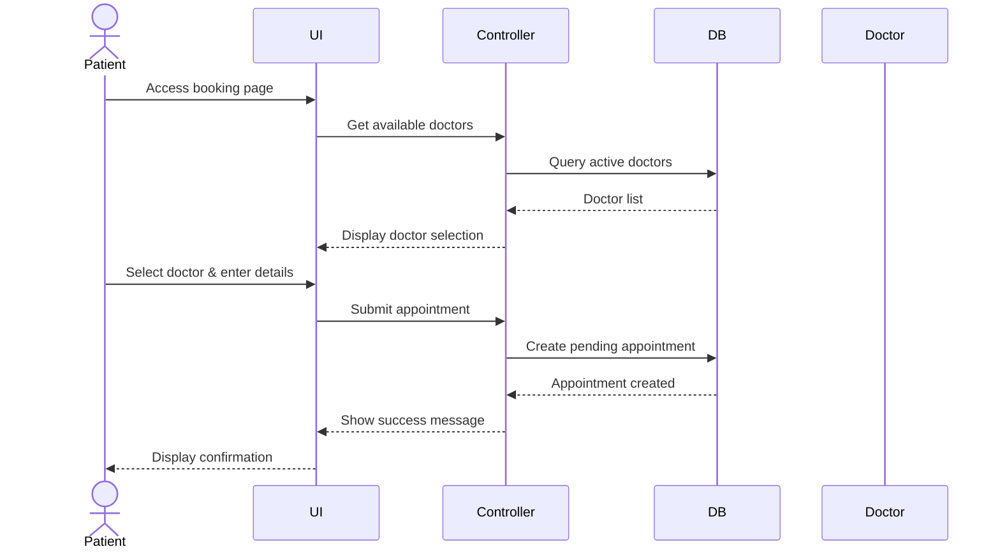
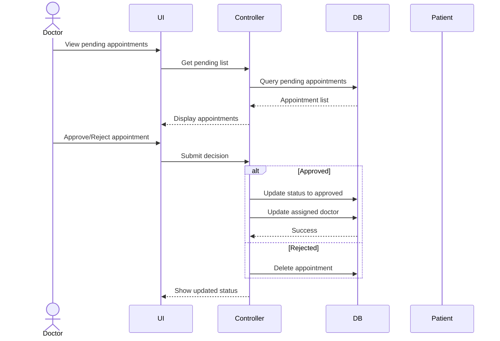
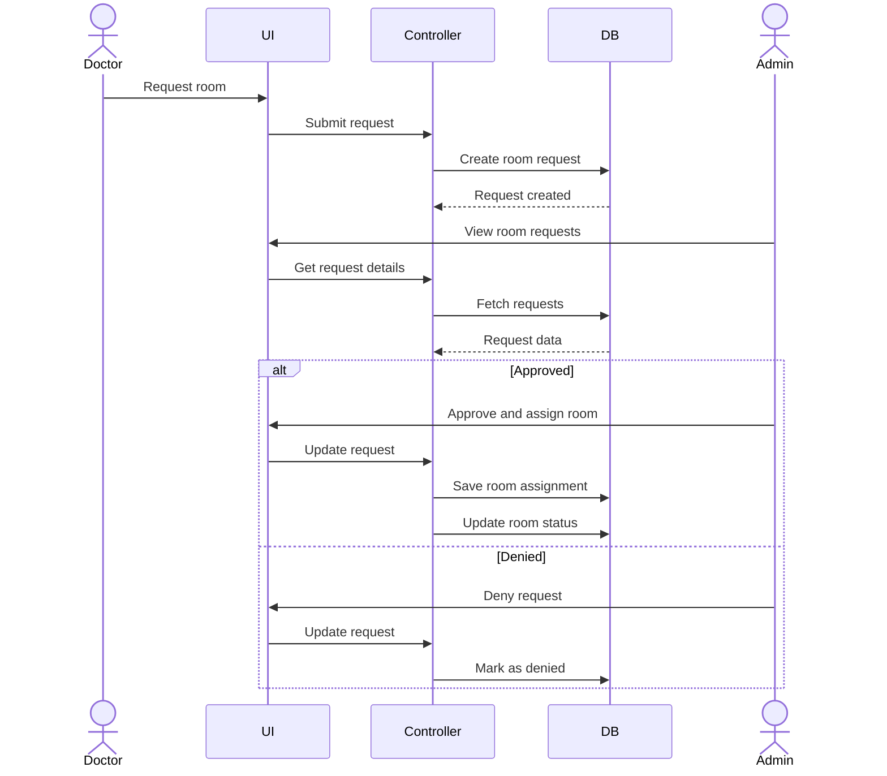
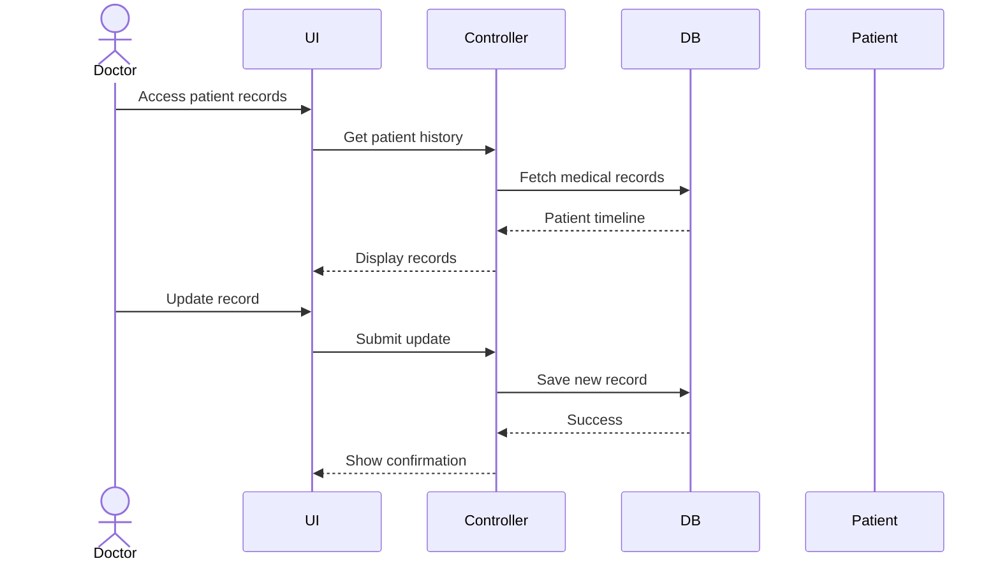
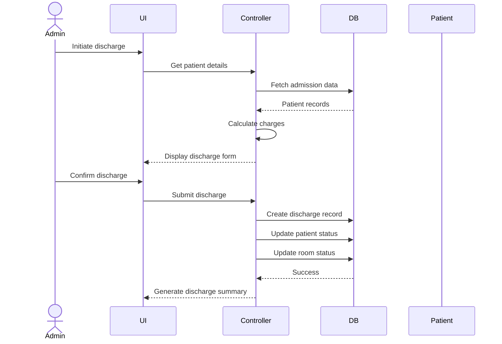

# Hospital Management System - Use Cases and Sequence Diagrams

## Core Use Cases

### Admin Use Cases

#### 1. Doctor Management
**Pre-conditions:** Admin is logged in

**Main Flow:**
1. View all doctors
2. Add new doctor
3. Update doctor information
4. Approve/reject doctor registrations
5. View doctor specializations
6. Delete doctor

#### 2. Patient Management
**Pre-conditions:** Admin is logged in

**Main Flow:**
1. View all patients
2. Add new patient
3. Update patient information
4. Approve/reject patient registrations
5. View patient details
6. Manage patient discharge

#### 3. Room Management
**Pre-conditions:** Admin is logged in

**Main Flow:**
1. View all rooms
2. Add new room
3. Update room information
4. Assign/change room for patient
5. Process room requests
6. View room occupancy

#### 4. Appointment Management
**Pre-conditions:** Admin is logged in

**Main Flow:**
1. View all appointments
2. Schedule new appointment
3. Approve/reject appointments
4. View appointment details
5. Cancel appointments

### Doctor Use Cases

#### 1. Patient Management
**Pre-conditions:** Doctor is logged in and approved

**Main Flow:**
1. View assigned patients
2. Search patients
3. View patient details
4. Update medical records
5. View discharge patients

#### 2. Appointment Management
**Pre-conditions:** Doctor is logged in and approved

**Main Flow:**
1. View appointments
2. Approve/reject appointment requests
3. View appointment schedule
4. Cancel appointments

#### 3. Room Management
**Pre-conditions:** Doctor is logged in and approved

**Main Flow:**
1. Request room for patient
2. View room requests status
3. Specify room requirements
4. Track request approval

### Patient Use Cases

#### 1. Appointment Management
**Pre-conditions:** Patient is logged in and approved

**Main Flow:**
1. Book new appointment
2. View appointments
3. View available doctors
4. Search doctors by department
5. Track appointment status

#### 2. Medical Records
**Pre-conditions:** Patient is logged in and approved

**Main Flow:**
1. View medical history
2. View assigned doctor
3. View treatment details
4. Access discharge summary

## Sequence Diagrams

### 1. Patient Appointment Booking

```mermaid
sequenceDiagram
    actor Patient
    participant UI
    participant Controller
    participant DB
    participant Doctor

    Patient->>UI: Access booking page
    UI->>Controller: Get available doctors
    Controller->>DB: Query active doctors
    DB-->>Controller: Doctor list
    Controller-->>UI: Display doctor selection
    
    Patient->>UI: Select doctor & enter details
    UI->>Controller: Submit appointment
    Controller->>DB: Create pending appointment
    DB-->>Controller: Appointment created
    Controller-->>UI: Show success message
    UI-->>Patient: Display confirmation
```

### 2. Doctor Appointment Approval

```mermaid
sequenceDiagram
    actor Doctor
    participant UI
    participant Controller
    participant DB
    participant Patient

    Doctor->>UI: View pending appointments
    UI->>Controller: Get pending list
    Controller->>DB: Query pending appointments
    DB-->>Controller: Appointment list
    Controller-->>UI: Display appointments

    Doctor->>UI: Approve/Reject appointment
    UI->>Controller: Submit decision
    
    alt Approved
        Controller->>DB: Update status to approved
        Controller->>DB: Update assigned doctor
        DB-->>Controller: Success
    else Rejected
        Controller->>DB: Delete appointment
    end
    
    Controller-->>UI: Show updated status
```

### 3. Room Request Process

```mermaid
sequenceDiagram
    actor Doctor
    participant UI
    participant Controller
    participant DB
    actor Admin

    Doctor->>UI: Request room
    UI->>Controller: Submit request
    Controller->>DB: Create room request
    DB-->>Controller: Request created

    Admin->>UI: View room requests
    UI->>Controller: Get request details
    Controller->>DB: Fetch requests
    DB-->>Controller: Request data
    
    alt Approved
        Admin->>UI: Approve and assign room
        UI->>Controller: Update request
        Controller->>DB: Save room assignment
        Controller->>DB: Update room status
    else Denied
        Admin->>UI: Deny request
        UI->>Controller: Update request
        Controller->>DB: Mark as denied
    end
```

### 4. Patient Medical Record Update

```mermaid
sequenceDiagram
    actor Doctor
    participant UI
    participant Controller
    participant DB
    participant Patient

    Doctor->>UI: Access patient records
    UI->>Controller: Get patient history
    Controller->>DB: Fetch medical records
    DB-->>Controller: Patient timeline
    Controller-->>UI: Display records
    
    Doctor->>UI: Update record
    UI->>Controller: Submit update
    Controller->>DB: Save new record
    DB-->>Controller: Success
    Controller-->>UI: Show confirmation
```

### 5. Patient Discharge Process

```mermaid
sequenceDiagram
    actor Admin
    participant UI
    participant Controller
    participant DB
    participant Patient

    Admin->>UI: Initiate discharge
    UI->>Controller: Get patient details
    Controller->>DB: Fetch admission data
    DB-->>Controller: Patient records
    
    Controller->>Controller: Calculate charges
    Controller-->>UI: Display discharge form
    Admin->>UI: Confirm discharge
    
    UI->>Controller: Submit discharge
    Controller->>DB: Create discharge record
    Controller->>DB: Update patient status
    Controller->>DB: Update room status
    
    DB-->>Controller: Success
    Controller-->>UI: Generate discharge summary
```

## System Features

### Authentication & Authorization
1. Role-based access control (Admin/Doctor/Patient)
2. Login with username/password
3. Session management
4. Access restrictions based on user role

### Data Management
1. Patient records with medical history
2. Doctor profiles with specializations
3. Room management with types (Ward/Private/ICU/Office)
4. Appointment scheduling system

### Security Features
1. Password hashing
2. CSRF protection
3. Form validation
4. Secure file uploads
5. Audit logging

### User Interface
1. Responsive dashboard for each role
2. Search functionality
3. Sorting and filtering
4. Status tracking
5. Notifications system