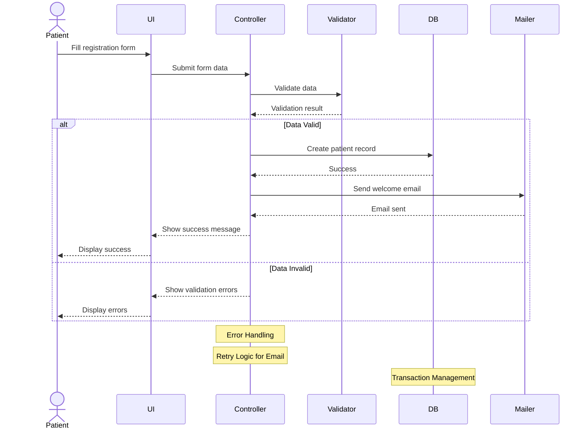
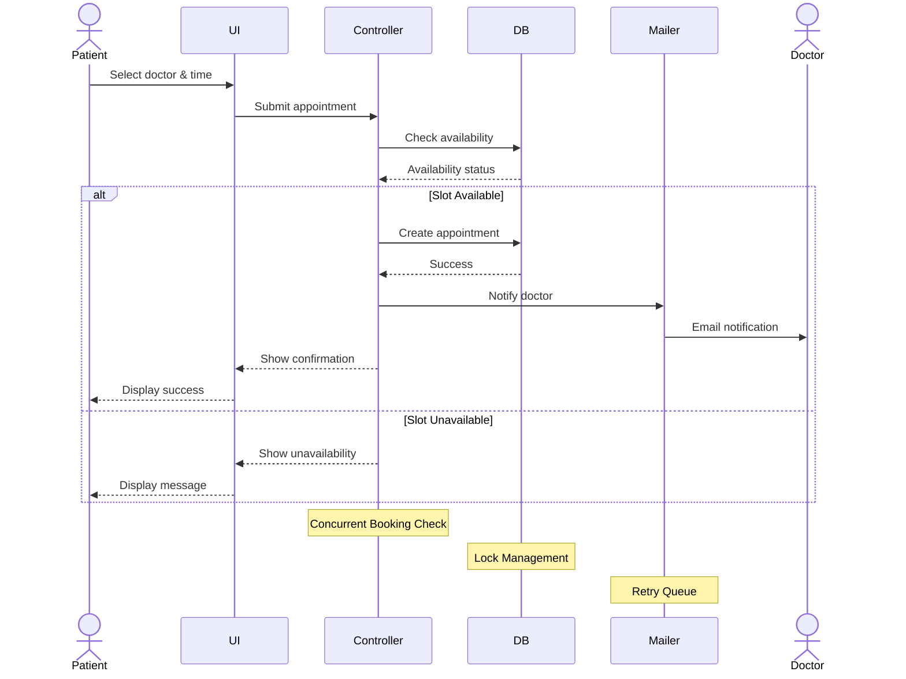
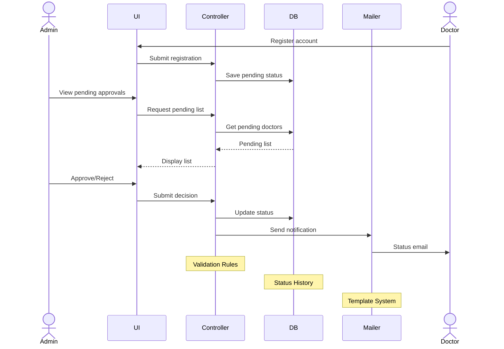
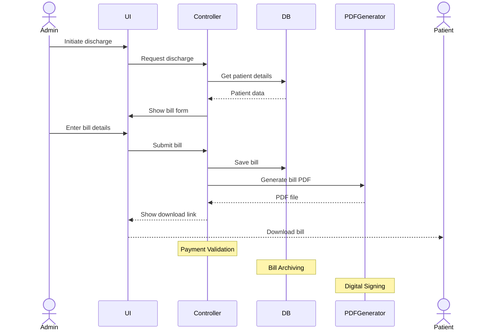
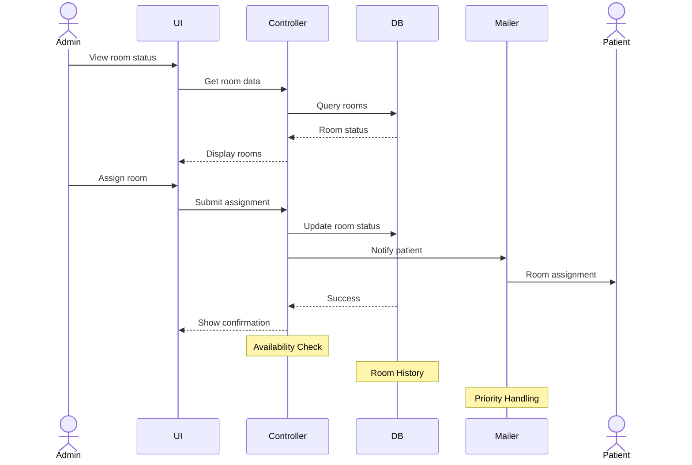
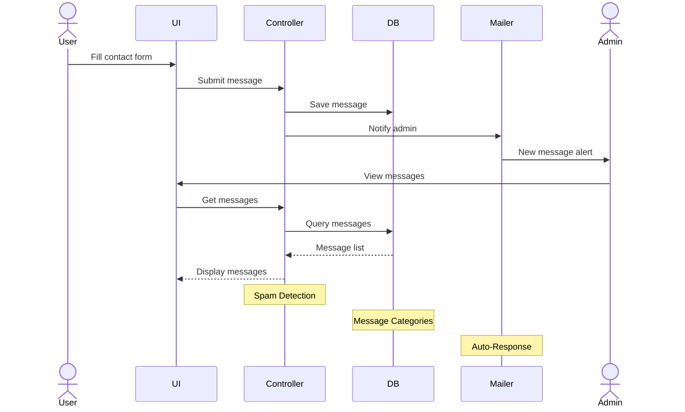

# Use Cases and Sequence Diagrams

## Detailed Use Cases

### User Management

#### 1. User Registration
**Primary Actor:** Patient/Doctor
**Pre-conditions:**
- System is accessible
- User has valid email address

**Main Flow:**
1. User selects registration type
2. System displays registration form
3. User fills required information
4. System validates input
5. System creates account
6. System sends verification email

**Alternative Flows:**
- A1: Invalid input
  1. System displays validation errors
  2. User corrects input
  3. Returns to step 4

**Post-conditions:**
- Account created (Patient)
- Account pending approval (Doctor)
- Verification email sent

#### 2. User Login
**Pre-conditions:**
- User has registered account
- Account is active

**Main Flow:**
1. User enters credentials
2. System validates credentials
3. System creates session
4. System redirects to dashboard

**Exception Flows:**
- E1: Invalid credentials
  1. System increments failed attempts
  2. System displays error
- E2: Account locked
  1. System displays lock message
  2. System provides recovery options

### Patient Use Cases

#### 1. Book Appointment
**Pre-conditions:**
- Patient is logged in
- Doctor is available

**Main Flow:**
1. Patient selects doctor
2. System shows available slots
3. Patient selects time slot
4. System confirms booking
5. System notifies doctor

**Alternative Flows:**
- A1: Slot becomes unavailable
  1. System updates availability
  2. Returns to step 2

**Exception Flows:**
- E1: System failure
  1. System logs error
  2. Displays friendly message
  3. Notifies admin

### Doctor Use Cases
1. View Assigned Patients
2. Manage Appointments
3. Update Patient Records
4. View Room Assignments
5. Request Room Changes

### Admin Use Cases
1. Approve/Reject Registrations
2. Manage Doctors
3. Manage Patients
4. Manage Rooms
5. Generate Reports
6. Handle Contact Messages

## Sequence Diagrams

### 1. Patient Registration

```mermaid
sequenceDiagram
    actor Patient
    participant UI
    participant Controller
    participant Validator
    participant DB
    participant Mailer

    Patient->>UI: Fill registration form
    UI->>Controller: Submit form data
    Controller->>Validator: Validate data
    Validator-->>Controller: Validation result
    
    alt Data Valid
        Controller->>DB: Create patient record
        DB-->>Controller: Success
        Controller->>Mailer: Send welcome email
        Mailer-->>Controller: Email sent
        Controller-->>UI: Show success message
        UI-->>Patient: Display success
    else Data Invalid
        Controller-->>UI: Show validation errors
        UI-->>Patient: Display errors
    end

    note over Controller: Error Handling
    note over Controller: Retry Logic for Email
    note over DB: Transaction Management
```

### 2. Appointment Booking

```mermaid
sequenceDiagram
    actor Patient
    participant UI
    participant Controller
    participant DB
    participant Mailer
    actor Doctor

    Patient->>UI: Select doctor & time
    UI->>Controller: Submit appointment
    Controller->>DB: Check availability
    DB-->>Controller: Availability status
    
    alt Slot Available
        Controller->>DB: Create appointment
        DB-->>Controller: Success
        Controller->>Mailer: Notify doctor
        Mailer->>Doctor: Email notification
        Controller-->>UI: Show confirmation
        UI-->>Patient: Display success
    else Slot Unavailable
        Controller-->>UI: Show unavailability
        UI-->>Patient: Display message
    end

    note over Controller: Concurrent Booking Check
    note over DB: Lock Management
    note over Mailer: Retry Queue
```

### 3. Doctor Approval Process

```mermaid
sequenceDiagram
    actor Admin
    participant UI
    participant Controller
    participant DB
    participant Mailer
    actor Doctor

    Doctor->>UI: Register account
    UI->>Controller: Submit registration
    Controller->>DB: Save pending status
    
    Admin->>UI: View pending approvals
    UI->>Controller: Request pending list
    Controller->>DB: Get pending doctors
    DB-->>Controller: Pending list
    Controller-->>UI: Display list
    
    Admin->>UI: Approve/Reject
    UI->>Controller: Submit decision
    Controller->>DB: Update status
    Controller->>Mailer: Send notification
    Mailer->>Doctor: Status email

    note over Controller: Validation Rules
    note over DB: Status History
    note over Mailer: Template System
```

### 4. Patient Discharge

```mermaid
sequenceDiagram
    actor Admin
    participant UI
    participant Controller
    participant DB
    participant PDFGenerator
    actor Patient

    Admin->>UI: Initiate discharge
    UI->>Controller: Request discharge
    Controller->>DB: Get patient details
    DB-->>Controller: Patient data
    Controller->>UI: Show bill form
    
    Admin->>UI: Enter bill details
    UI->>Controller: Submit bill
    Controller->>DB: Save bill
    Controller->>PDFGenerator: Generate bill PDF
    PDFGenerator-->>Controller: PDF file
    Controller-->>UI: Show download link
    UI-->>Patient: Download bill

    note over Controller: Payment Validation
    note over DB: Bill Archiving
    note over PDFGenerator: Digital Signing
```

### 5. Room Management

```mermaid
sequenceDiagram
    actor Admin
    participant UI
    participant Controller
    participant DB
    participant Mailer
    actor Patient

    Admin->>UI: View room status
    UI->>Controller: Get room data
    Controller->>DB: Query rooms
    DB-->>Controller: Room status
    Controller-->>UI: Display rooms
    
    Admin->>UI: Assign room
    UI->>Controller: Submit assignment
    Controller->>DB: Update room status
    Controller->>Mailer: Notify patient
    Mailer->>Patient: Room assignment
    DB-->>Controller: Success
    Controller-->>UI: Show confirmation

    note over Controller: Availability Check
    note over DB: Room History
    note over Mailer: Priority Handling
```

### 6. Contact Message Handling

```mermaid
sequenceDiagram
    actor User
    participant UI
    participant Controller
    participant DB
    participant Mailer
    actor Admin

    User->>UI: Fill contact form
    UI->>Controller: Submit message
    Controller->>DB: Save message
    Controller->>Mailer: Notify admin
    Mailer->>Admin: New message alert
    
    Admin->>UI: View messages
    UI->>Controller: Get messages
    Controller->>DB: Query messages
    DB-->>Controller: Message list
    Controller-->>UI: Display messages

    note over Controller: Spam Detection
    note over DB: Message Categories
    note over Mailer: Auto-Response
```

## Error Handling Scenarios

### Common Error Scenarios
1. Network Timeout
2. Database Connection Loss
3. Email Service Failure
4. Concurrent Access Conflicts
5. Session Expiry
6. File Upload Issues
7. Payment Gateway Errors
8. PDF Generation Failures

### Error Recovery Procedures
1. Automatic Retry Logic
2. Fallback Mechanisms
3. Transaction Rollback
4. User Notification
5. Admin Alerts
6. Error Logging
7. Data Recovery
8. Session Recovery 