# Use Cases and Sequence Diagrams

## Detailed Use Cases

### User Management

#### 1. User Registration
**Primary Actor:** Patient/Doctor
**Pre-conditions:**
- System is accessible
- User has valid email address

**Main Flow:**
1. User selects registration type
2. System displays registration form
3. User fills required information
4. System validates input
5. System creates account
6. System sends verification email

**Alternative Flows:**
- A1: Invalid input
  1. System displays validation errors
  2. User corrects input
  3. Returns to step 4

**Post-conditions:**
- Account created (Patient)
- Account pending approval (Doctor)
- Verification email sent

#### 2. User Login
**Pre-conditions:**
- User has registered account
- Account is active

**Main Flow:**
1. User enters credentials
2. System validates credentials
3. System creates session
4. System redirects to dashboard

**Exception Flows:**
- E1: Invalid credentials
  1. System increments failed attempts
  2. System displays error
- E2: Account locked
  1. System displays lock message
  2. System provides recovery options

### Patient Use Cases

#### 1. Book Appointment
**Pre-conditions:**
- Patient is logged in
- Doctor is available

**Main Flow:**
1. Patient selects doctor
2. System shows available slots
3. Patient selects time slot
4. System confirms booking
5. System notifies doctor

**Alternative Flows:**
- A1: Slot becomes unavailable
  1. System updates availability
  2. Returns to step 2

**Exception Flows:**
- E1: System failure
  1. System logs error
  2. Displays friendly message
  3. Notifies admin

#### 2. View Medical History
**Pre-conditions:**
- Patient is logged in
- Has existing medical records

**Main Flow:**
1. Patient accesses medical history
2. System displays timeline view
3. Patient selects record
4. System shows detailed view
5. Patient can download/print

**Alternative Flows:**
- A1: No records found
  1. System shows empty state
  2. Provides guidance

#### 3. Manage Profile
**Pre-conditions:**
- Patient is logged in

**Main Flow:**
1. Patient accesses profile
2. Updates personal information
3. Updates medical information
4. System validates changes
5. System saves updates

**Exception Flows:**
- E1: Invalid data
  1. System highlights errors
  2. Maintains current data

#### 4. Handle Payments
**Pre-conditions:**
- Patient has pending bills
- Payment gateway is available

**Main Flow:**
1. Patient views bills
2. Selects payment method
3. Enters payment details
4. System processes payment
5. Generates receipt

**Alternative Flows:**
- A1: Payment failure
  1. System retries
  2. Offers alternative methods

#### 5. Request Medical Documents
**Pre-conditions:**
- Patient has completed visits

**Main Flow:**
1. Patient selects document type
2. Specifies requirements
3. System generates document
4. Patient downloads/prints
5. System logs request

#### 6. Emergency Contact Management
**Pre-conditions:**
- Patient is logged in

**Main Flow:**
1. Patient accesses contacts
2. Adds/updates contact
3. Sets relationship
4. System validates
5. Updates records

#### 7. Medication Tracking
**Pre-conditions:**
- Patient has prescriptions

**Main Flow:**
1. View current medications
2. Set reminders
3. Track adherence
4. Report side effects
5. Request refills

#### 8. Appointment Management
**Pre-conditions:**
- Has existing appointments

**Main Flow:**
1. View appointments
2. Reschedule if needed
3. Cancel if required
4. Get notifications
5. Rate service

### Doctor Use Cases
1. View Assigned Patients
2. Manage Appointments
3. Update Patient Records
4. View Room Assignments
5. Request Room Changes

### Admin Use Cases
1. Approve/Reject Registrations
2. Manage Doctors
3. Manage Patients
4. Manage Rooms
5. Generate Reports
6. Handle Contact Messages

## Sequence Diagrams

### 1. Patient Registration

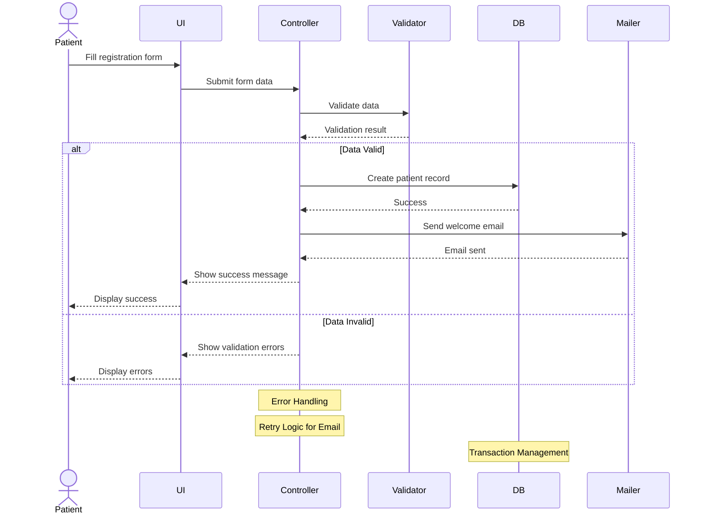
```mermaid
sequenceDiagram
    actor Patient
    participant UI
    participant Controller
    participant Validator
    participant DB
    participant Mailer

    Patient->>UI: Fill registration form
    UI->>Controller: Submit form data
    Controller->>Validator: Validate data
    Validator-->>Controller: Validation result
    
    alt Data Valid
        Controller->>DB: Create patient record
        DB-->>Controller: Success
        Controller->>Mailer: Send welcome email
        Mailer-->>Controller: Email sent
        Controller-->>UI: Show success message
        UI-->>Patient: Display success
    else Data Invalid
        Controller-->>UI: Show validation errors
        UI-->>Patient: Display errors
    end

    note over Controller: Error Handling
    note over Controller: Retry Logic for Email
    note over DB: Transaction Management
```

### 2. Appointment Booking

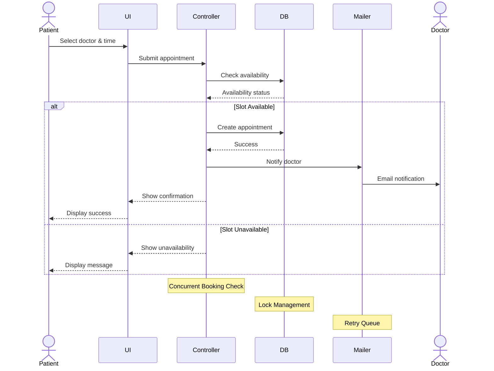
```mermaid
sequenceDiagram
    actor Patient
    participant UI
    participant Controller
    participant DB
    participant Mailer
    actor Doctor

    Patient->>UI: Select doctor & time
    UI->>Controller: Submit appointment
    Controller->>DB: Check availability
    DB-->>Controller: Availability status
    
    alt Slot Available
        Controller->>DB: Create appointment
        DB-->>Controller: Success
        Controller->>Mailer: Notify doctor
        Mailer->>Doctor: Email notification
        Controller-->>UI: Show confirmation
        UI-->>Patient: Display success
    else Slot Unavailable
        Controller-->>UI: Show unavailability
        UI-->>Patient: Display message
    end

    note over Controller: Concurrent Booking Check
    note over DB: Lock Management
    note over Mailer: Retry Queue
```

### 3. Doctor Approval Process

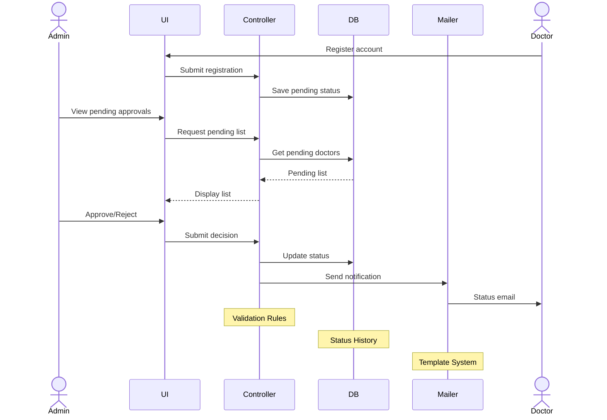
```mermaid
sequenceDiagram
    actor Admin
    participant UI
    participant Controller
    participant DB
    participant Mailer
    actor Doctor

    Doctor->>UI: Register account
    UI->>Controller: Submit registration
    Controller->>DB: Save pending status
    
    Admin->>UI: View pending approvals
    UI->>Controller: Request pending list
    Controller->>DB: Get pending doctors
    DB-->>Controller: Pending list
    Controller-->>UI: Display list
    
    Admin->>UI: Approve/Reject
    UI->>Controller: Submit decision
    Controller->>DB: Update status
    Controller->>Mailer: Send notification
    Mailer->>Doctor: Status email

    note over Controller: Validation Rules
    note over DB: Status History
    note over Mailer: Template System
```

### 4. Patient Discharge

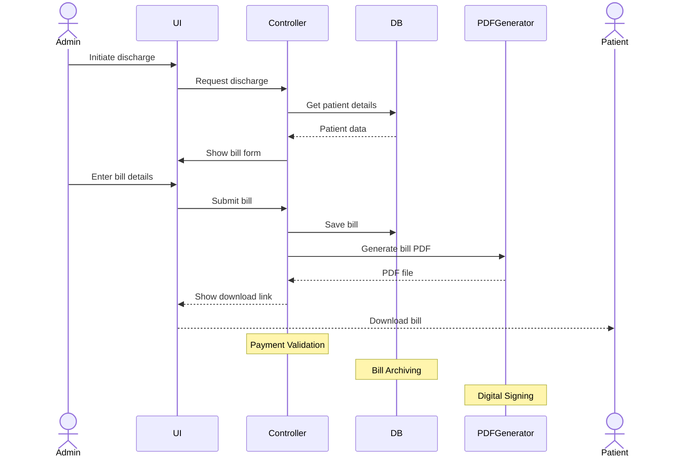
```mermaid
sequenceDiagram
    actor Admin
    participant UI
    participant Controller
    participant DB
    participant PDFGenerator
    actor Patient

    Admin->>UI: Initiate discharge
    UI->>Controller: Request discharge
    Controller->>DB: Get patient details
    DB-->>Controller: Patient data
    Controller->>UI: Show bill form
    
    Admin->>UI: Enter bill details
    UI->>Controller: Submit bill
    Controller->>DB: Save bill
    Controller->>PDFGenerator: Generate bill PDF
    PDFGenerator-->>Controller: PDF file
    Controller-->>UI: Show download link
    UI-->>Patient: Download bill

    note over Controller: Payment Validation
    note over DB: Bill Archiving
    note over PDFGenerator: Digital Signing
```

### 5. Room Management

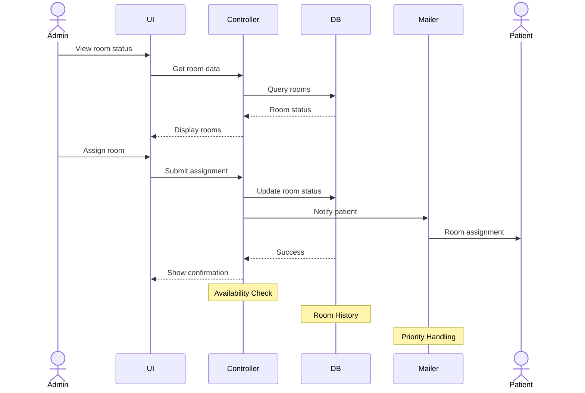
```mermaid
sequenceDiagram
    actor Admin
    participant UI
    participant Controller
    participant DB
    participant Mailer
    actor Patient

    Admin->>UI: View room status
    UI->>Controller: Get room data
    Controller->>DB: Query rooms
    DB-->>Controller: Room status
    Controller-->>UI: Display rooms
    
    Admin->>UI: Assign room
    UI->>Controller: Submit assignment
    Controller->>DB: Update room status
    Controller->>Mailer: Notify patient
    Mailer->>Patient: Room assignment
    DB-->>Controller: Success
    Controller-->>UI: Show confirmation

    note over Controller: Availability Check
    note over DB: Room History
    note over Mailer: Priority Handling
```

### 6. Contact Message Handling

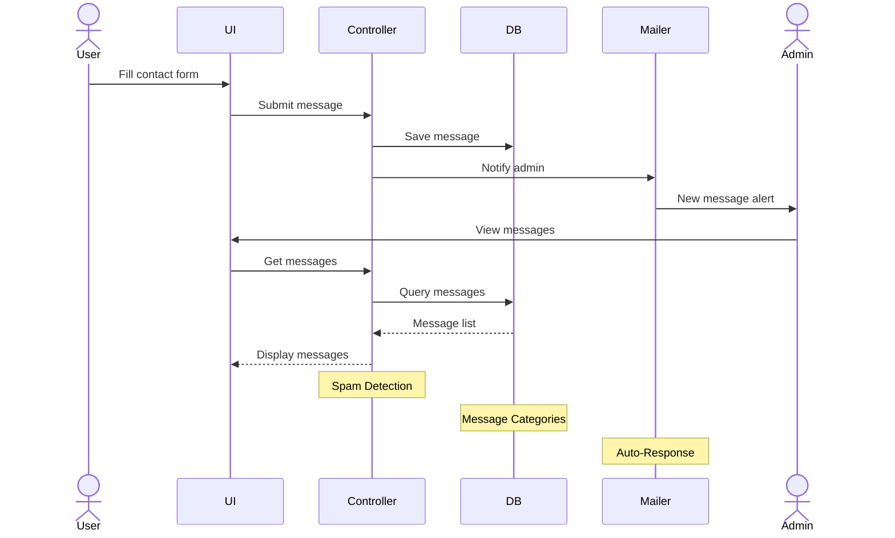
```mermaid
sequenceDiagram
    actor User
    participant UI
    participant Controller
    participant DB
    participant Mailer
    actor Admin

    User->>UI: Fill contact form
    UI->>Controller: Submit message
    Controller->>DB: Save message
    Controller->>Mailer: Notify admin
    Mailer->>Admin: New message alert
    
    Admin->>UI: View messages
    UI->>Controller: Get messages
    Controller->>DB: Query messages
    DB-->>Controller: Message list
    Controller-->>UI: Display messages

    note over Controller: Spam Detection
    note over DB: Message Categories
    note over Mailer: Auto-Response
```

### 6. View Medical History

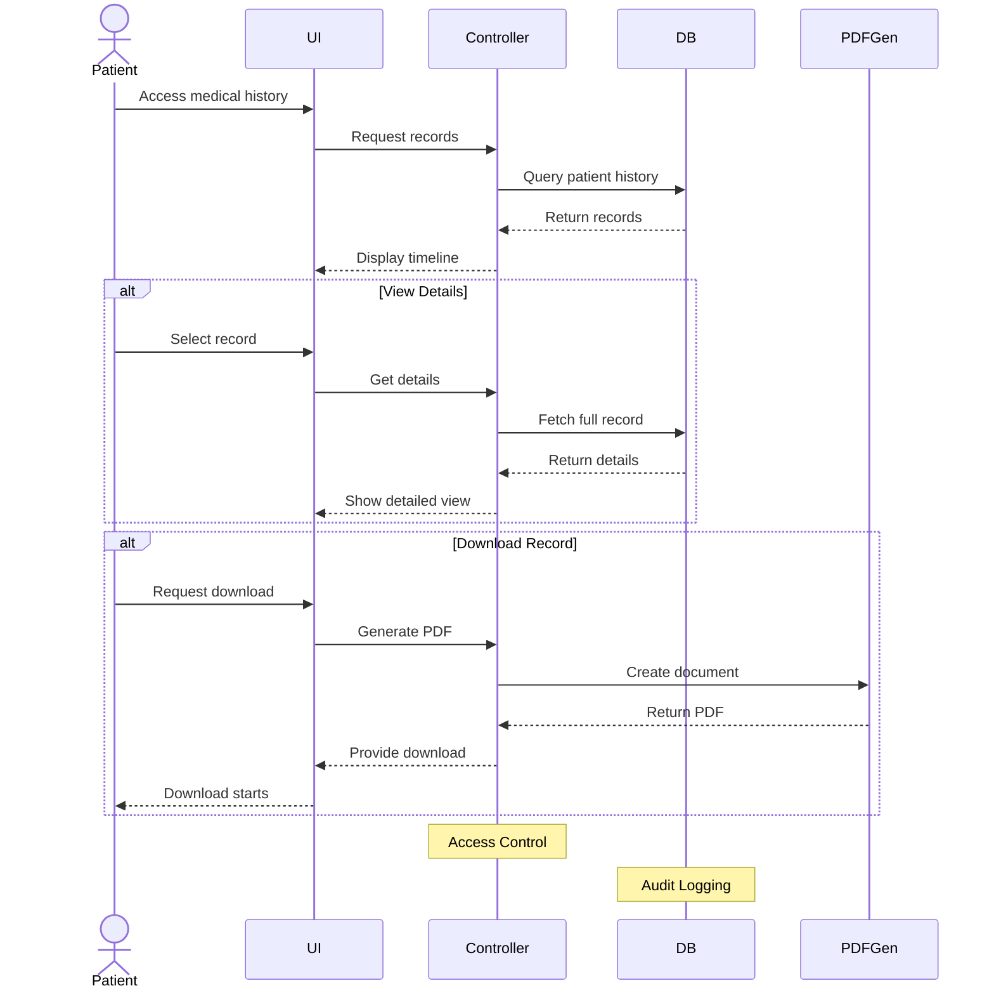
```mermaid
sequenceDiagram
    actor Patient
    participant UI
    participant Controller
    participant DB
    participant PDFGen

    Patient->>UI: Access medical history
    UI->>Controller: Request records
    Controller->>DB: Query patient history
    DB-->>Controller: Return records
    Controller-->>UI: Display timeline
    
    alt View Details
        Patient->>UI: Select record
        UI->>Controller: Get details
        Controller->>DB: Fetch full record
        DB-->>Controller: Return details
        Controller-->>UI: Show detailed view
    end

    alt Download Record
        Patient->>UI: Request download
        UI->>Controller: Generate PDF
        Controller->>PDFGen: Create document
        PDFGen-->>Controller: Return PDF
        Controller-->>UI: Provide download
        UI-->>Patient: Download starts
    end

    note over Controller: Access Control
    note over DB: Audit Logging
```

### 7. Medication Tracking

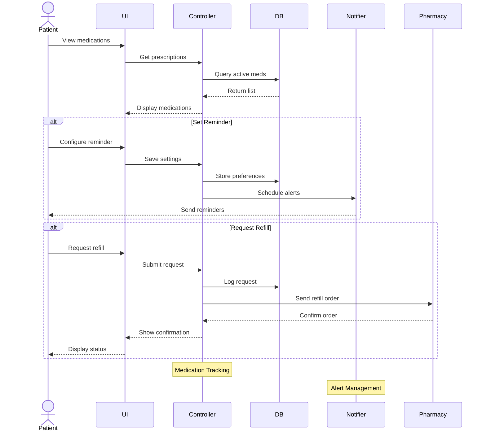
```mermaid
sequenceDiagram
    actor Patient
    participant UI
    participant Controller
    participant DB
    participant Notifier
    participant Pharmacy

    Patient->>UI: View medications
    UI->>Controller: Get prescriptions
    Controller->>DB: Query active meds
    DB-->>Controller: Return list
    Controller-->>UI: Display medications
    
    alt Set Reminder
        Patient->>UI: Configure reminder
        UI->>Controller: Save settings
        Controller->>DB: Store preferences
        Controller->>Notifier: Schedule alerts
        Notifier-->>Patient: Send reminders
    end

    alt Request Refill
        Patient->>UI: Request refill
        UI->>Controller: Submit request
        Controller->>DB: Log request
        Controller->>Pharmacy: Send refill order
        Pharmacy-->>Controller: Confirm order
        Controller-->>UI: Show confirmation
        UI-->>Patient: Display status
    end

    note over Controller: Medication Tracking
    note over Notifier: Alert Management
```

### 8. Emergency Contact Management

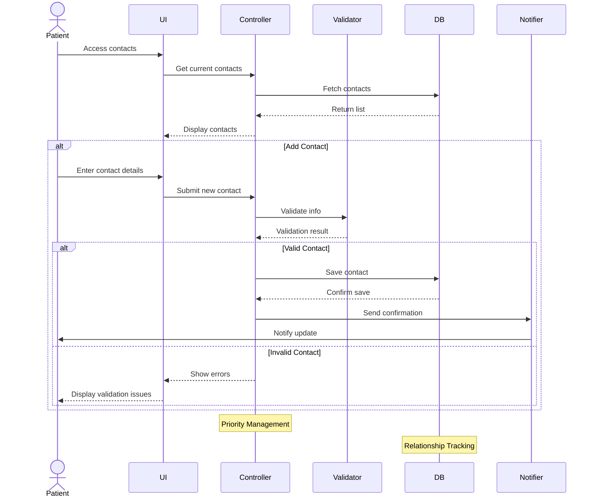
```mermaid
sequenceDiagram
    actor Patient
    participant UI
    participant Controller
    participant Validator
    participant DB
    participant Notifier

    Patient->>UI: Access contacts
    UI->>Controller: Get current contacts
    Controller->>DB: Fetch contacts
    DB-->>Controller: Return list
    Controller-->>UI: Display contacts
    
    alt Add Contact
        Patient->>UI: Enter contact details
        UI->>Controller: Submit new contact
        Controller->>Validator: Validate info
        Validator-->>Controller: Validation result
        
        alt Valid Contact
            Controller->>DB: Save contact
            DB-->>Controller: Confirm save
            Controller->>Notifier: Send confirmation
            Notifier->>Patient: Notify update
        else Invalid Contact
            Controller-->>UI: Show errors
            UI-->>Patient: Display validation issues
        end
    end

    note over Controller: Priority Management
    note over DB: Relationship Tracking
```

### 9. Document Request

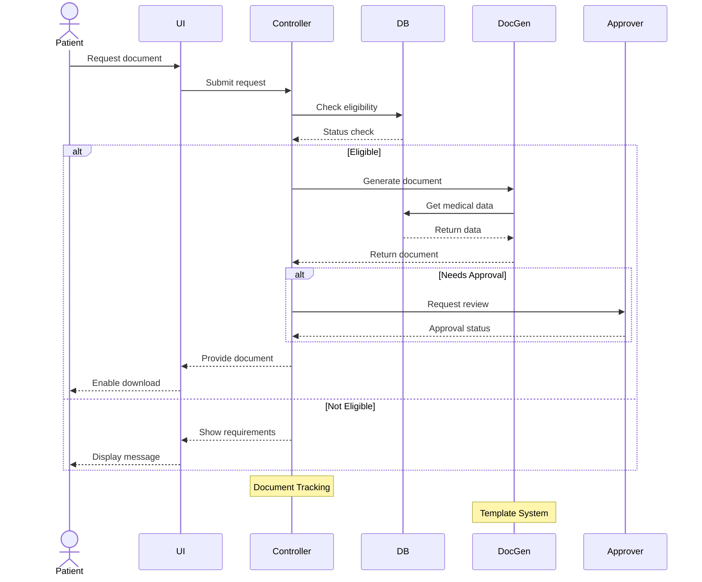
```mermaid
sequenceDiagram
    actor Patient
    participant UI
    participant Controller
    participant DB
    participant DocGen
    participant Approver

    Patient->>UI: Request document
    UI->>Controller: Submit request
    Controller->>DB: Check eligibility
    DB-->>Controller: Status check
    
    alt Eligible
        Controller->>DocGen: Generate document
        DocGen->>DB: Get medical data
        DB-->>DocGen: Return data
        DocGen-->>Controller: Return document
        
        alt Needs Approval
            Controller->>Approver: Request review
            Approver-->>Controller: Approval status
        end
        
        Controller-->>UI: Provide document
        UI-->>Patient: Enable download
    else Not Eligible
        Controller-->>UI: Show requirements
        UI-->>Patient: Display message
    end

    note over Controller: Document Tracking
    note over DocGen: Template System
```

### 10. Payment Processing

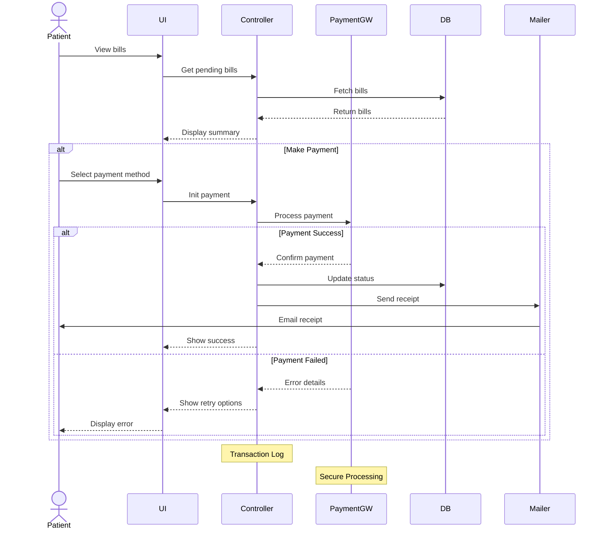
```mermaid
sequenceDiagram
    actor Patient
    participant UI
    participant Controller
    participant PaymentGW
    participant DB
    participant Mailer

    Patient->>UI: View bills
    UI->>Controller: Get pending bills
    Controller->>DB: Fetch bills
    DB-->>Controller: Return bills
    Controller-->>UI: Display summary
    
    alt Make Payment
        Patient->>UI: Select payment method
        UI->>Controller: Init payment
        Controller->>PaymentGW: Process payment
        
        alt Payment Success
            PaymentGW-->>Controller: Confirm payment
            Controller->>DB: Update status
            Controller->>Mailer: Send receipt
            Mailer->>Patient: Email receipt
            Controller-->>UI: Show success
        else Payment Failed
            PaymentGW-->>Controller: Error details
            Controller-->>UI: Show retry options
            UI-->>Patient: Display error
        end
    end

    note over Controller: Transaction Log
    note over PaymentGW: Secure Processing
```

### 11. Doctor - Patient Management

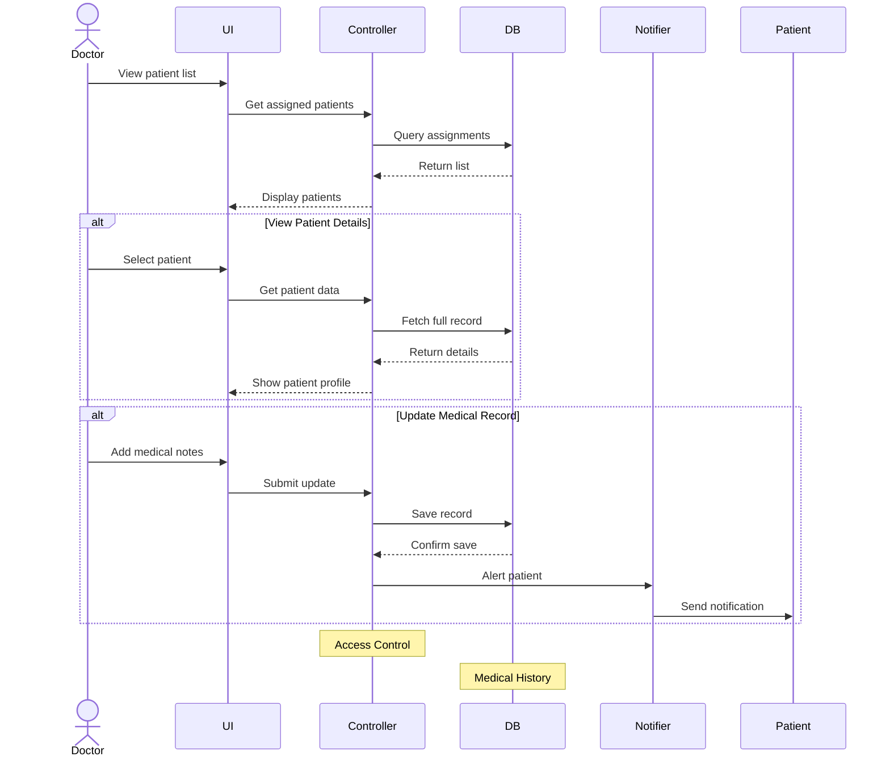
```mermaid
sequenceDiagram
    actor Doctor
    participant UI
    participant Controller
    participant DB
    participant Notifier

    Doctor->>UI: View patient list
    UI->>Controller: Get assigned patients
    Controller->>DB: Query assignments
    DB-->>Controller: Return list
    Controller-->>UI: Display patients
    
    alt View Patient Details
        Doctor->>UI: Select patient
        UI->>Controller: Get patient data
        Controller->>DB: Fetch full record
        DB-->>Controller: Return details
        Controller-->>UI: Show patient profile
    end

    alt Update Medical Record
        Doctor->>UI: Add medical notes
        UI->>Controller: Submit update
        Controller->>DB: Save record
        DB-->>Controller: Confirm save
        Controller->>Notifier: Alert patient
        Notifier->>Patient: Send notification
    end

    note over Controller: Access Control
    note over DB: Medical History
```

### 12. Doctor - Appointment Management

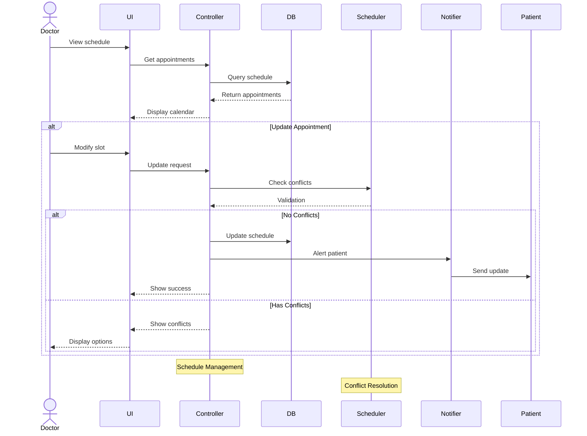
```mermaid
sequenceDiagram
    actor Doctor
    participant UI
    participant Controller
    participant DB
    participant Scheduler
    participant Notifier

    Doctor->>UI: View schedule
    UI->>Controller: Get appointments
    Controller->>DB: Query schedule
    DB-->>Controller: Return appointments
    Controller-->>UI: Display calendar
    
    alt Update Appointment
        Doctor->>UI: Modify slot
        UI->>Controller: Update request
        Controller->>Scheduler: Check conflicts
        Scheduler-->>Controller: Validation
        
        alt No Conflicts
            Controller->>DB: Update schedule
            Controller->>Notifier: Alert patient
            Notifier->>Patient: Send update
            Controller-->>UI: Show success
        else Has Conflicts
            Controller-->>UI: Show conflicts
            UI-->>Doctor: Display options
        end
    end

    note over Controller: Schedule Management
    note over Scheduler: Conflict Resolution
```

### 13. Doctor - Resource Management

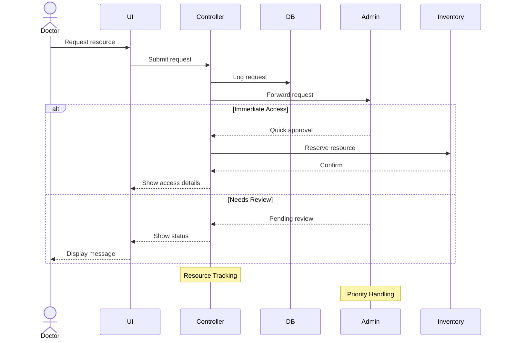
```mermaid
sequenceDiagram
    actor Doctor
    participant UI
    participant Controller
    participant DB
    participant Admin
    participant Inventory

    Doctor->>UI: Request resource
    UI->>Controller: Submit request
    Controller->>DB: Log request
    Controller->>Admin: Forward request
    
    alt Immediate Access
        Admin-->>Controller: Quick approval
        Controller->>Inventory: Reserve resource
        Inventory-->>Controller: Confirm
        Controller-->>UI: Show access details
    else Needs Review
        Admin-->>Controller: Pending review
        Controller-->>UI: Show status
        UI-->>Doctor: Display message
    end

    note over Controller: Resource Tracking
    note over Admin: Priority Handling
```

### 14. Doctor - Prescription Management

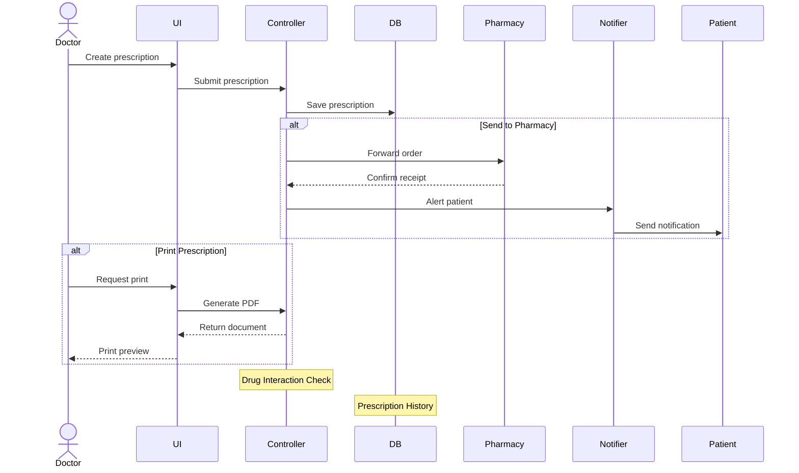
```mermaid
sequenceDiagram
    actor Doctor
    participant UI
    participant Controller
    participant DB
    participant Pharmacy
    participant Notifier

    Doctor->>UI: Create prescription
    UI->>Controller: Submit prescription
    Controller->>DB: Save prescription
    
    alt Send to Pharmacy
        Controller->>Pharmacy: Forward order
        Pharmacy-->>Controller: Confirm receipt
        Controller->>Notifier: Alert patient
        Notifier->>Patient: Send notification
    end
    
    alt Print Prescription
        Doctor->>UI: Request print
        UI->>Controller: Generate PDF
        Controller-->>UI: Return document
        UI-->>Doctor: Print preview
    end

    note over Controller: Drug Interaction Check
    note over DB: Prescription History
```

### 15. Doctor - Lab Results Management

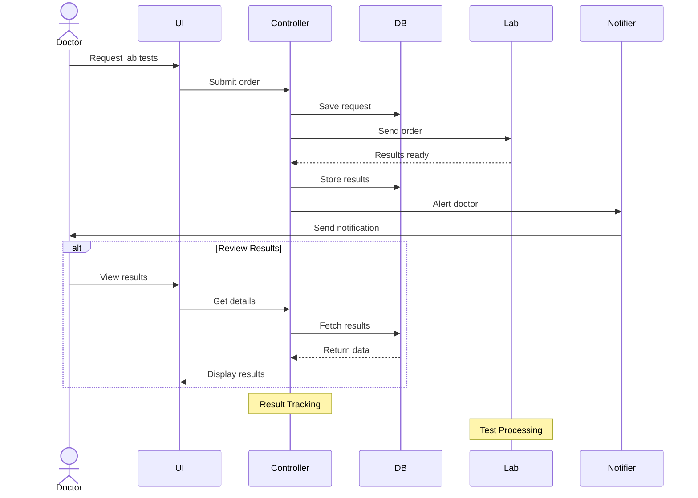
```mermaid
sequenceDiagram
    actor Doctor
    participant UI
    participant Controller
    participant DB
    participant Lab
    participant Notifier

    Doctor->>UI: Request lab tests
    UI->>Controller: Submit order
    Controller->>DB: Save request
    Controller->>Lab: Send order
    
    Lab-->>Controller: Results ready
    Controller->>DB: Store results
    Controller->>Notifier: Alert doctor
    Notifier->>Doctor: Send notification
    
    alt Review Results
        Doctor->>UI: View results
        UI->>Controller: Get details
        Controller->>DB: Fetch results
        DB-->>Controller: Return data
        Controller-->>UI: Display results
    end

    note over Controller: Result Tracking
    note over Lab: Test Processing
```

### 16. Admin - User Management

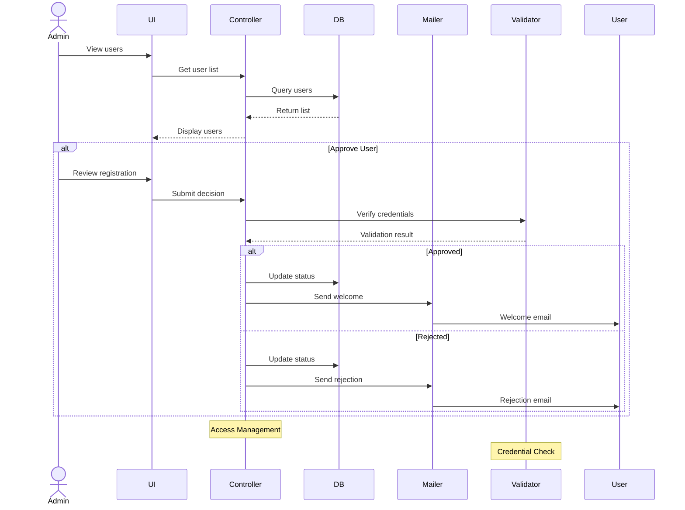
```mermaid
sequenceDiagram
    actor Admin
    participant UI
    participant Controller
    participant DB
    participant Mailer
    participant Validator

    Admin->>UI: View users
    UI->>Controller: Get user list
    Controller->>DB: Query users
    DB-->>Controller: Return list
    Controller-->>UI: Display users
    
    alt Approve User
        Admin->>UI: Review registration
        UI->>Controller: Submit decision
        Controller->>Validator: Verify credentials
        Validator-->>Controller: Validation result
        
        alt Approved
            Controller->>DB: Update status
            Controller->>Mailer: Send welcome
            Mailer->>User: Welcome email
        else Rejected
            Controller->>DB: Update status
            Controller->>Mailer: Send rejection
            Mailer->>User: Rejection email
        end
    end

    note over Controller: Access Management
    note over Validator: Credential Check
```

### 17. Admin - System Configuration

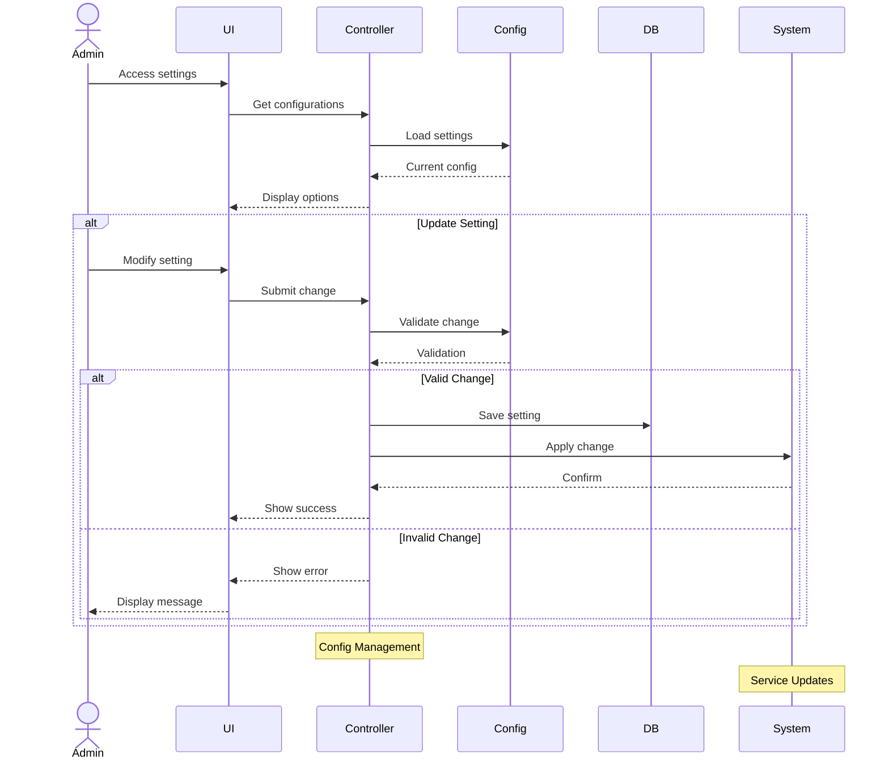
```mermaid
sequenceDiagram
    actor Admin
    participant UI
    participant Controller
    participant Config
    participant DB
    participant System

    Admin->>UI: Access settings
    UI->>Controller: Get configurations
    Controller->>Config: Load settings
    Config-->>Controller: Current config
    Controller-->>UI: Display options
    
    alt Update Setting
        Admin->>UI: Modify setting
        UI->>Controller: Submit change
        Controller->>Config: Validate change
        Config-->>Controller: Validation
        
        alt Valid Change
            Controller->>DB: Save setting
            Controller->>System: Apply change
            System-->>Controller: Confirm
            Controller-->>UI: Show success
        else Invalid Change
            Controller-->>UI: Show error
            UI-->>Admin: Display message
        end
    end

    note over Controller: Config Management
    note over System: Service Updates
```

### 18. Admin - Resource Management

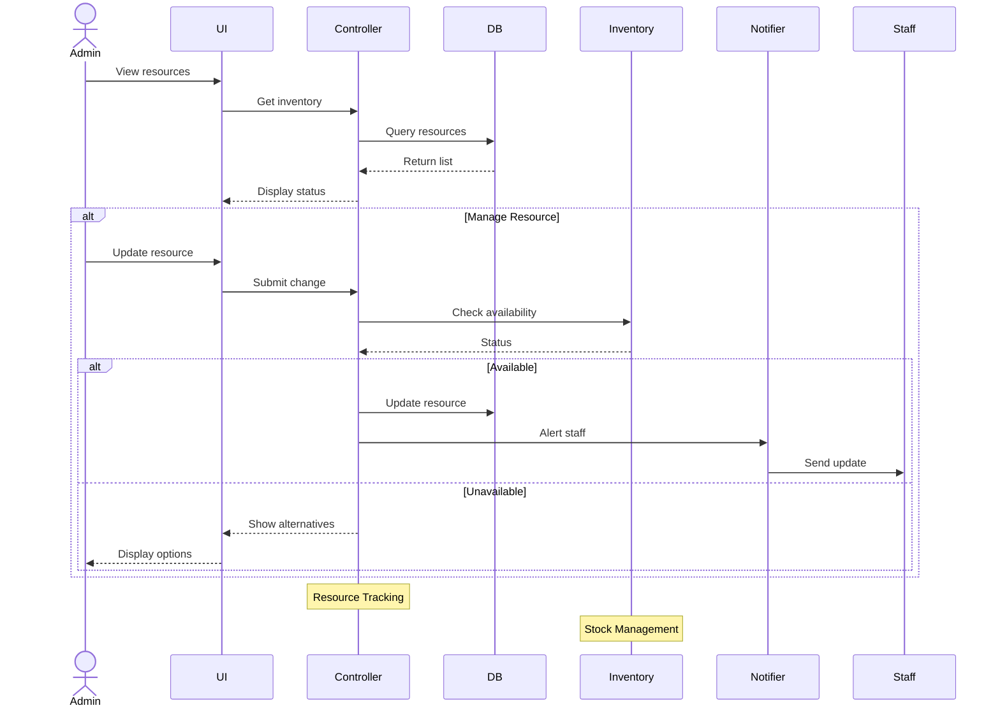
```mermaid
sequenceDiagram
    actor Admin
    participant UI
    participant Controller
    participant DB
    participant Inventory
    participant Notifier

    Admin->>UI: View resources
    UI->>Controller: Get inventory
    Controller->>DB: Query resources
    DB-->>Controller: Return list
    Controller-->>UI: Display status
    
    alt Manage Resource
        Admin->>UI: Update resource
        UI->>Controller: Submit change
        Controller->>Inventory: Check availability
        Inventory-->>Controller: Status
        
        alt Available
            Controller->>DB: Update resource
            Controller->>Notifier: Alert staff
            Notifier->>Staff: Send update
        else Unavailable
            Controller-->>UI: Show alternatives
            UI-->>Admin: Display options
        end
    end

    note over Controller: Resource Tracking
    note over Inventory: Stock Management
```

### 19. Admin - Report Generation

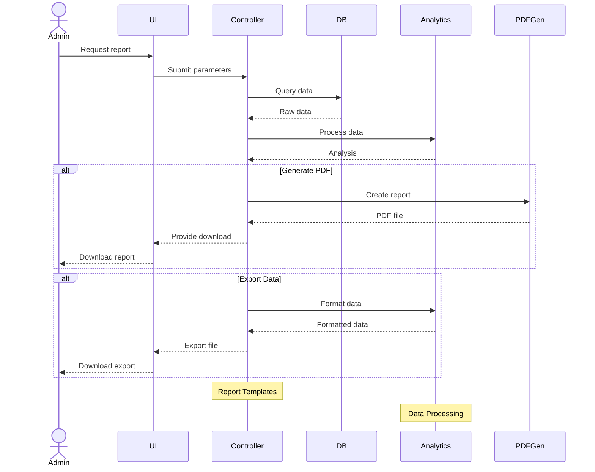
```mermaid
sequenceDiagram
    actor Admin
    participant UI
    participant Controller
    participant DB
    participant Analytics
    participant PDFGen

    Admin->>UI: Request report
    UI->>Controller: Submit parameters
    Controller->>DB: Query data
    DB-->>Controller: Raw data
    Controller->>Analytics: Process data
    Analytics-->>Controller: Analysis
    
    alt Generate PDF
        Controller->>PDFGen: Create report
        PDFGen-->>Controller: PDF file
        Controller-->>UI: Provide download
        UI-->>Admin: Download report
    end
    
    alt Export Data
        Controller->>Analytics: Format data
        Analytics-->>Controller: Formatted data
        Controller-->>UI: Export file
        UI-->>Admin: Download export
    end

    note over Controller: Report Templates
    note over Analytics: Data Processing
```

### 20. Admin - Audit Management

```mermaid
sequenceDiagram
    actor Admin
    participant UI
    participant Controller
    participant DB
    participant Logger
    participant Security

    Admin->>UI: View audit logs
    UI->>Controller: Request logs
    Controller->>Security: Verify access
    Security-->>Controller: Authorization
    
    alt Access Granted
        Controller->>DB: Query audit trail
        DB-->>Controller: Return logs
        Controller-->>UI: Display audit
        
        alt Export Logs
            Admin->>UI: Request export
            UI->>Controller: Generate report
            Controller->>Logger: Format logs
            Logger-->>Controller: Formatted data
            Controller-->>UI: Provide download
            UI-->>Admin: Download logs
        end
    else Access Denied
        Controller-->>UI: Show error
        UI-->>Admin: Display message
    end

    note over Controller: Audit Trail
    note over Security: Access Control
```

### 21. User Login Process

```mermaid
sequenceDiagram
    actor User
    participant UI
    participant Controller
    participant Auth
    participant DB
    participant Security

    User->>UI: Enter credentials
    UI->>Controller: Submit login
    Controller->>Security: Sanitize input
    Security-->>Controller: Clean data
    Controller->>Auth: Validate credentials
    Auth->>DB: Check user
    DB-->>Auth: User data
    
    alt Valid Credentials
        Auth->>Security: Generate token
        Security-->>Auth: Session token
        Auth-->>Controller: Auth success
        Controller->>DB: Log login
        Controller-->>UI: Redirect to dashboard
        UI-->>User: Show dashboard
    else Invalid Credentials
        Auth-->>Controller: Auth failed
        Controller->>DB: Log attempt
        Controller-->>UI: Show error
        UI-->>User: Display message
    end

    note over Auth: Rate Limiting
    note over Security: Token Management
```

### 22. Room Assignment Process

```mermaid
sequenceDiagram
    actor Admin
    participant UI
    participant Controller
    participant DB
    participant RoomMgr
    participant Notifier
    actor Staff

    Admin->>UI: View room status
    UI->>Controller: Get room data
    Controller->>DB: Query rooms
    DB-->>Controller: Room list
    Controller-->>UI: Display status
    
    alt Assign Room
        Admin->>UI: Select assignment
        UI->>Controller: Submit assignment
        Controller->>RoomMgr: Check availability
        RoomMgr->>DB: Verify status
        DB-->>RoomMgr: Current status
        
        alt Room Available
            RoomMgr-->>Controller: Confirmed
            Controller->>DB: Update assignment
            Controller->>Notifier: Alert staff
            Notifier->>Staff: Assignment notice
            Controller-->>UI: Show success
        else Room Occupied
            RoomMgr-->>Controller: Unavailable
            Controller-->>UI: Show conflict
            UI-->>Admin: Display options
        end
    end

    note over RoomMgr: Capacity Management
    note over DB: Assignment History
```

### 23. Contact Message Handling

```mermaid
sequenceDiagram
    actor User
    participant UI
    participant Controller
    participant Validator
    participant DB
    participant Mailer
    actor Admin

    User->>UI: Submit contact form
    UI->>Controller: Send message
    Controller->>Validator: Validate input
    Validator-->>Controller: Validation result
    
    alt Valid Message
        Controller->>DB: Store message
        DB-->>Controller: Confirm save
        Controller->>Mailer: Send copy
        Mailer->>User: Confirmation email
        Controller->>Mailer: Notify admin
        Mailer->>Admin: New message alert
        Controller-->>UI: Show success
    else Invalid Input
        Controller-->>UI: Show errors
        UI-->>User: Display issues
    end
    
    alt Admin Response
        Admin->>UI: View message
        UI->>Controller: Get details
        Controller->>DB: Fetch message
        DB-->>Controller: Message data
        Controller-->>UI: Show message
        
        Admin->>UI: Send response
        UI->>Controller: Submit response
        Controller->>DB: Save response
        Controller->>Mailer: Send to user
        Mailer->>User: Response email
    end

    note over Controller: Message Priority
    note over DB: Thread Management
```

### 24. Password Recovery Process

```mermaid
sequenceDiagram
    actor User
    participant UI
    participant Controller
    participant Security
    participant DB
    participant Mailer

    User->>UI: Request reset
    UI->>Controller: Submit email
    Controller->>DB: Verify email
    DB-->>Controller: User exists
    
    alt Valid Email
        Controller->>Security: Generate token
        Security-->>Controller: Reset token
        Controller->>DB: Save token
        Controller->>Mailer: Send reset link
        Mailer->>User: Reset email
        Controller-->>UI: Show instructions
    else Invalid Email
        Controller-->>UI: Show error
        UI-->>User: Display message
    end
    
    alt Reset Password
        User->>UI: Click reset link
        UI->>Controller: Verify token
        Controller->>Security: Validate token
        Security-->>Controller: Token status
        
        alt Valid Token
            User->>UI: Enter new password
            UI->>Controller: Submit password
            Controller->>Security: Hash password
            Security-->>Controller: Hashed password
            Controller->>DB: Update password
            Controller->>Mailer: Send confirmation
            Mailer->>User: Success email
        else Invalid Token
            Controller-->>UI: Show error
            UI-->>User: Display message
        end
    end

    note over Security: Token Expiry
    note over Controller: Password Policy
```

### 25. Inventory Management

```mermaid
sequenceDiagram
    actor Admin
    participant UI
    participant Controller
    participant DB
    participant Inventory
    participant Notifier
    actor Staff

    Admin->>UI: View inventory
    UI->>Controller: Get items
    Controller->>DB: Query stock
    DB-->>Controller: Item list
    Controller-->>UI: Display inventory
    
    alt Update Stock
        Admin->>UI: Modify quantity
        UI->>Controller: Submit update
        Controller->>Inventory: Check threshold
        Inventory-->>Controller: Status check
        
        alt Above Threshold
            Controller->>DB: Update stock
            Controller-->>UI: Show success
        else Below Threshold
            Controller->>DB: Update stock
            Controller->>Notifier: Alert staff
            Notifier->>Staff: Low stock alert
            Controller-->>UI: Show warning
        end
    end
    
    alt Order Supplies
        Admin->>UI: Create order
        UI->>Controller: Submit order
        Controller->>DB: Save order
        Controller->>Notifier: Notify supplier
        Notifier->>Supplier: Order details
        Controller-->>UI: Show confirmation
    end

    note over Inventory: Stock Levels
    note over Controller: Order Tracking
```

## Error Handling Scenarios

### Common Error Scenarios
1. Network Timeout
2. Database Connection Loss
3. Email Service Failure
4. Concurrent Access Conflicts
5. Session Expiry
6. File Upload Issues
7. Payment Gateway Errors
8. PDF Generation Failures

### Error Recovery Procedures
1. Automatic Retry Logic
2. Fallback Mechanisms
3. Transaction Rollback
4. User Notification
5. Admin Alerts
6. Error Logging
7. Data Recovery
8. Session Recovery 